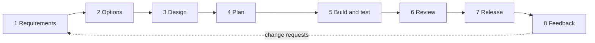
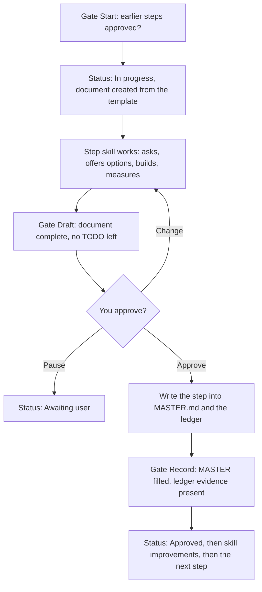

# VLSIT Software Development Flow

> **AI partner that works with the user to develop any software.**
> **Đối tác AI cùng người dùng phát triển mọi phần mềm.**

Nine paired AI skills for **Codex** and **Claude Code** that guide an assistant through the whole life cycle of a **desktop or mobile application**: requirements, comparison of options, design, plan, build and test, independent review, release and feedback.

Chín skill AI theo cặp cho **Codex** và **Claude Code**, hướng dẫn trợ lý đi hết vòng đời của một **ứng dụng máy tính hoặc điện thoại**: yêu cầu, so sánh phương án, thiết kế, kế hoạch, xây dựng và kiểm thử, rà soát độc lập, phát hành và phản hồi.

**Author / Tác giả:** Nguyễn Quân — GitHub [@nguyenquanicd](https://github.com/nguyenquanicd) — Repository: [VLSIT_Software_Development_FLow](https://github.com/nguyenquanicd/VLSIT_Software_Development_FLow) — Apache License 2.0.

**Naming / Cách đặt tên:** every skill is named `vlsit-sdf-<name>`: `vlsit-` is the prefix shared by all VLSIT skills and `sdf` stands for *software development flow* (the orchestrator is `vlsit-sdf-flow`). The project documents folder keeps the short name `docs/sdf/`. / Mọi skill đặt tên `vlsit-sdf-<tên>`: `vlsit-` là tiền tố chung của các skill VLSIT và `sdf` là viết tắt của *software development flow* (skill tổng là `vlsit-sdf-flow`). Thư mục tài liệu dự án giữ tên ngắn `docs/sdf/`.

## Contents / Mục lục

1. [Overview / Tổng quan](#overview)
2. [How it works / Cách hoạt động](#how-it-works)
3. [The nine skills in detail / Chi tiết chín skill](#the-skills)
4. [The rules the skills enforce / Các quy tắc bắt buộc](#the-rules)
5. [Install / Cài đặt](#install)
6. [Quick start / Bắt đầu nhanh](#quick-start)
7. [Using it with Claude Code and Codex / Dùng với Claude Code và Codex](#tools)
8. [Files created in your project / Tệp tạo trong dự án của bạn](#project-files)
9. [Tracks: Full, Lite, Hotfix / Các luồng](#tracks)
10. [Changing something already approved / Thay đổi sau khi duyệt](#change-control)
11. [Scripts reference / Tham chiếu script](#scripts)
12. [The skill library / Thư viện script](#library)
13. [Desktop and mobile notes / Lưu ý máy tính và điện thoại](#platforms)
14. [Repository layout / Cấu trúc repository](#layout)
15. [Maintain and extend / Bảo trì và mở rộng](#maintain)
16. [Troubleshooting and FAQ / Xử lý sự cố và hỏi đáp](#faq)
17. [What is and is not verified / Đã và chưa kiểm chứng](#verified)
18. [Glossary / Thuật ngữ](#glossary)
19. [Documentation, author and license / Tài liệu, tác giả và giấy phép](#license)

---

<a id="overview"></a>
## 1. Overview / Tổng quan

**English.** Building software with an AI assistant often goes wrong in the same ways: the AI guesses what you want, shows you one solution as if there were no choice, ignores memory use, security and cost until it is too late, and leaves no record of what was decided. This repository is a set of skills (instruction folders that Codex and Claude Code load on demand) that prevent those failures. One orchestrator skill, `vlsit-sdf-flow`, manages the flow; eight step skills do the work. After every step you approve explicitly, and the approved content is written into one consolidated file, `docs/sdf/MASTER.md`, in your project.

**Tiếng Việt.** Làm phần mềm cùng trợ lý AI thường hỏng theo những cách quen thuộc: AI đoán điều bạn muốn, đưa ra một giải pháp như thể không có lựa chọn khác, bỏ qua bộ nhớ, bảo mật và chi phí cho tới khi quá muộn, và không để lại ghi chép nào về những gì đã quyết. Repository này là một bộ skill (các thư mục hướng dẫn mà Codex và Claude Code nạp khi cần) để ngăn các lỗi đó. Một skill tổng `vlsit-sdf-flow` quản lý quy trình; tám skill từng bước thực hiện công việc. Sau mỗi bước bạn duyệt rõ ràng, và nội dung đã chốt được ghi vào một file tổng hợp duy nhất `docs/sdf/MASTER.md` trong dự án của bạn.

### What is different / Điểm khác biệt

| # | English | Tiếng Việt |
|---|---|---|
| 1 | **Confirm, never guess.** Every requirement is confirmed with you in small batches. Every question says **why** it is asked. | **Xác nhận, không đoán.** Mọi yêu cầu được xác nhận với bạn theo từng nhóm nhỏ. Mọi câu hỏi nói rõ **vì sao** hỏi. |
| 2 | **Choices, not a single proposal.** Every choice that is yours comes as 2 to 4 options with pros, cons and the effect on memory, security, cost and time. | **Lựa chọn, không phải một đề xuất duy nhất.** Mọi lựa chọn thuộc về bạn có 2 đến 4 phương án kèm ưu điểm, nhược điểm và tác động tới bộ nhớ, bảo mật, chi phí, thời gian. |
| 3 | **The AI evaluates options itself** right after the requirements: tables, weights you confirm, a sensitivity check, and a recommendation. | **AI tự đánh giá phương án** ngay sau yêu cầu: bảng so sánh, trọng số do bạn xác nhận, kiểm tra độ nhạy và đề xuất. |
| 4 | **Low memory (RAM first), security and lowest total cost** are first-class in every step, tracked by an evidence ledger. | **Ít bộ nhớ (ưu tiên RAM), bảo mật và tổng chi phí thấp nhất** là yêu cầu hàng đầu ở mọi bước, được theo dõi bằng sổ bằng chứng. |
| 5 | **Approval gate after every step**, and a **consolidated record** (`MASTER.md`) updated each time. | **Cổng duyệt sau mỗi bước** và **bản ghi tổng hợp** (`MASTER.md`) được cập nhật mỗi lần. |
| 6 | **Evidence, not claims.** A number is measured, or it is written `NOT MEASURED`. | **Bằng chứng, không phải lời nói.** Số liệu được đo, hoặc ghi `NOT MEASURED`. |
| 7 | **A script library that improves with each build.** Reusable scripts are saved, checked and reused, with your approval. | **Thư viện script cải thiện sau mỗi lần build.** Script tái sử dụng được lưu, kiểm tra và dùng lại, khi bạn duyệt. |
| 8 | **Safe by design.** The AI never handles private keys, never spends money or publishes without your confirmation, and never edits its own instructions. | **An toàn từ thiết kế.** AI không bao giờ xử lý khóa riêng, không chi tiền hay phát hành khi chưa được bạn xác nhận, và không tự sửa hướng dẫn của chính nó. |
| 9 | **You always know where you are.** Every question starts with a progress line: the step that is running and how many steps remain. | **Bạn luôn biết mình đang ở đâu.** Mỗi câu hỏi mở đầu bằng một dòng tiến độ: bước đang chạy và số bước còn lại. |

### Who it is for / Dành cho ai

**English.** Individual developers, small teams and company projects building Windows, macOS or Linux desktop apps and Android or iOS mobile apps. You do not need to know the process in advance: the AI leads, and you decide. For a one-line fix, use the Lite or Hotfix track (section 9), or do not use the flow at all.

**Tiếng Việt.** Lập trình viên cá nhân, nhóm nhỏ và dự án trong công ty xây dựng ứng dụng máy tính (Windows, macOS, Linux) và ứng dụng điện thoại (Android, iOS). Bạn không cần biết trước quy trình: AI dẫn dắt, bạn quyết định. Với sửa lỗi một dòng, dùng luồng Lite hoặc Hotfix (mục 9), hoặc không cần dùng quy trình này.

---

<a id="how-it-works"></a>
## 2. How it works / Cách hoạt động



**English.** The flow has eight steps. Each step is a skill. `vlsit-sdf-flow` runs them in order and never starts the next one until you have approved the previous one. Every step follows the same cycle:

**Tiếng Việt.** Quy trình gồm tám bước, mỗi bước là một skill. `vlsit-sdf-flow` chạy lần lượt và không bắt đầu bước sau khi bạn chưa duyệt bước trước. Mọi bước theo cùng một chu trình:



| # | English | Tiếng Việt |
|---|---|---|
| 1 | **Gate Start** checks that every earlier step is `Approved` or `Skipped`. | **Cổng Start** kiểm tra mọi bước trước đã `Approved` hoặc `Skipped`. |
| 2 | The step is set `In progress` and its document is created from a template. | Bước được đặt `In progress` và tài liệu được tạo từ mẫu. |
| 3 | The step skill does the work, asking you questions with their reasons and offering options. | Skill của bước làm việc, hỏi bạn kèm lý do và đưa ra các phương án. |
| 4 | **Gate Draft** checks the document has every required heading and no unfilled `TODO(sdf)` marker. | **Cổng Draft** kiểm tra tài liệu có đủ các tiêu đề bắt buộc và không còn dấu `TODO(sdf)`. |
| 5 | You get a summary, the assumptions you would accept, and the open waivers, and you choose **A) Approve, B) Change, C) Pause**. | Bạn nhận bản tóm tắt, các giả định bạn sắp chấp nhận, các ngoại lệ đang mở, và chọn **A) Duyệt, B) Sửa, C) Tạm dừng**. |
| 6 | After approval the content is written into `MASTER.md` and the ledger. **Gate Record** checks it. | Sau khi duyệt, nội dung được ghi vào `MASTER.md` và sổ bằng chứng. **Cổng Record** kiểm tra. |
| 7 | Reusable scripts and lessons found in the step are offered as one batch (section 12). The status becomes `Approved`. | Script tái sử dụng và bài học tìm được trong bước được đề xuất theo một lô (mục 12). Trạng thái thành `Approved`. |

**English.** Status values: `Not started`, `In progress`, `Awaiting approval`, `Awaiting user`, `Approved`, `Reopened`, `Skipped`.

**Tiếng Việt.** Các trạng thái: `Not started` (chưa bắt đầu), `In progress` (đang làm), `Awaiting approval` (chờ duyệt), `Awaiting user` (chờ người dùng), `Approved` (đã duyệt), `Reopened` (mở lại), `Skipped` (bỏ qua).

### Progress line / Dòng tiến độ

**English.** Every message that asks you anything (intake questions, question batches, option tables, read-backs, approval prompts, status reports) **starts with a progress line**, and every question header repeats the step, the steps left and the question number, so you always know which step is running and how many remain:

**Tiếng Việt.** Mọi tin nhắn có hỏi bạn điều gì (câu hỏi tiếp nhận, các nhóm câu hỏi, bảng phương án, bản đọc lại, lời nhắc duyệt, báo cáo trạng thái) **đều mở đầu bằng một dòng tiến độ**, và tiêu đề của mỗi câu hỏi nhắc lại bước, số bước còn lại và số thứ tự câu hỏi, để bạn luôn biết bước nào đang chạy và còn bao nhiêu bước:

```
Progress: step 2 of 8 - Options [In progress] | steps remaining after this one: 6 (3 Design, 4 Plan, 5 Build, 6 Review, 7 Release, 8 Feedback) | weights, part 1 of 3
Q-014 - Weights   [step 2 of 8 | 6 steps left | question 1 of 3]
```

**English.** The line is computed from the status table in `MASTER.md`, not guessed: `sdf-status.ps1 -ProjectDir <dir> -Brief` prints it. The current step is the first one that is not `Approved` or `Skipped`; steps a shorter track skipped are not counted and are listed (`| skipped: 2, 3`). Before step 1 it says `setup, before step 1`; a reopened step shows `[Reopened]`; when everything is done it says no steps remain. Inside a step the AI adds the position when there are known parts (topic T6 of 11, design chunk 2 of 4, task 3 of 12).

**Tiếng Việt.** Dòng này được tính từ bảng trạng thái trong `MASTER.md`, không đoán: `sdf-status.ps1 -ProjectDir <thư mục> -Brief` in ra dòng đó. Bước hiện tại là bước đầu tiên chưa `Approved` hoặc `Skipped`; các bước bị luồng ngắn hơn bỏ qua không được tính và được liệt kê (`| skipped: 2, 3`). Trước bước 1 dòng ghi `setup, before step 1`; bước được mở lại hiện `[Reopened]`; khi xong hết thì ghi không còn bước nào. Trong một bước, AI thêm vị trí khi có các phần xác định (chủ đề T6 trên 11, phần thiết kế 2 trên 4, việc 3 trên 12).

---

<a id="the-skills"></a>
## 3. The nine skills in detail / Chi tiết chín skill

| Skill | Step / Bước | One line / Một dòng |
|---|---|---|
| `vlsit-sdf-flow` | Orchestrator / Tổng | Starts or resumes a project, runs the steps, gates, records `MASTER.md`. / Khởi tạo hoặc tiếp tục dự án, chạy các bước, kiểm soát cổng, ghi `MASTER.md`. |
| `vlsit-sdf-requirements` | 1 | Confirmed, testable requirements with resource, security and cost budgets. / Yêu cầu đã xác nhận, kiểm thử được, kèm ngân sách tài nguyên, bảo mật và chi phí. |
| `vlsit-sdf-options` | 2 | The AI compares options and recommends the cheapest that qualifies. / AI so sánh phương án và đề xuất phương án rẻ nhất đáp ứng yêu cầu. |
| `vlsit-sdf-design` | 3 | Architecture, memory budget per component, cost design, threat model. / Kiến trúc, ngân sách bộ nhớ từng thành phần, thiết kế chi phí, mô hình mối đe dọa. |
| `vlsit-sdf-plan` | 4 | Small tasks, tests first, walking skeleton with measurement, cost estimate. / Việc nhỏ, test trước, bộ khung chạy được có đo lường, ước tính chi phí. |
| `vlsit-sdf-build` | 5 | Test-first implementation, memory measured on release builds, cost guard. / Triển khai test trước, đo bộ nhớ trên bản release, chốt chặn chi phí. |
| `vlsit-sdf-review` | 6 | Independent audit of traceability, resources, security and cost. / Kiểm toán độc lập truy vết, tài nguyên, bảo mật và chi phí. |
| `vlsit-sdf-release` | 7 | Signed, verified, staged release with a fee check. / Phát hành có ký, đã kiểm chứng, theo giai đoạn, có kiểm tra phí. |
| `vlsit-sdf-feedback` | 8 | Triage, running cost, incidents, change requests, lessons. / Phân loại phản hồi, chi phí vận hành, sự cố, yêu cầu thay đổi, bài học. |

### 3.0 `vlsit-sdf-flow` — orchestrator / skill tổng

**English.**
- **What it does:** looks for `docs/sdf/MASTER.md`. If found, it shows the status and asks what to do (continue, reopen a step, handle a change request). If not, it runs the **project intake**: document language (always the first question), what is being built, target platforms, where the code lives, whether the AI may run commands and commit, the **skill improvement policy** (`ask`, `auto`, `off`), and the master copy of the skills if you want new scripts carried back. It then creates `MASTER.md`, runs the steps in order, enforces the gates, records approvals, and handles the batch of skill improvements.
- **You decide:** the language, platforms, track, commit and script policies, and every approval.
- **You get:** `docs/sdf/MASTER.md` and a status you can ask for at any time.

**Tiếng Việt.**
- **Việc làm:** tìm `docs/sdf/MASTER.md`. Nếu có, hiển thị trạng thái và hỏi bạn muốn làm gì (tiếp tục, mở lại một bước, xử lý yêu cầu thay đổi). Nếu chưa có, chạy **tiếp nhận dự án**: ngôn ngữ tài liệu (luôn là câu hỏi đầu tiên), điều đang xây dựng, nền tảng đích, vị trí mã nguồn, AI có được chạy lệnh và commit không, **chính sách cải thiện skill** (`ask`, `auto`, `off`), và bản gốc của skill nếu bạn muốn mang script mới về đó. Sau đó tạo `MASTER.md`, chạy các bước theo thứ tự, thực thi các cổng, ghi nhận phê duyệt và xử lý lô cải thiện skill.
- **Bạn quyết định:** ngôn ngữ, nền tảng, luồng, chính sách commit và script, và mọi phê duyệt.
- **Bạn nhận:** `docs/sdf/MASTER.md` và trạng thái xem được bất cứ lúc nào.

### 3.1 Step 1 — Requirements / Bước 1 — Yêu cầu (`vlsit-sdf-requirements`)

**English.**
- **What the AI does:** reads the repository and any documents first, restates what it understood, then works through **eleven topics**: T1 goal, users, success; T2 scope; T3 platforms and environment; T4 behaviour per feature; T5 data; **T6 resource budgets** (mandatory); **T7 security and privacy** (mandatory); **T8 cost** (mandatory); T9 quality and experience; T10 delivery constraints; T11 priorities and trade-offs. Each question is asked with its **why**, options (with pros and cons) and a default if you do not know. Requirements get IDs (`REQ`, `NFR-RES`, `NFR-SEC`, `NFR-COST`, `CON`), priorities (MoSCoW) and acceptance criteria. Four scans run: ambiguity (words like "fast", "light", "secure" must become numbers or named controls), conflicts, completeness and testability. Finally the whole register is read back to you.
- **You decide:** every requirement; the memory and other budgets; what must be protected; the cost caps and who pays; the priority order and what may be traded.
- **You get:** `docs/sdf/01-requirements.md`, and ledger rows for every resource, security and cost requirement.
- **Done when:** all eleven topics are covered or confirmed not applicable; every requirement has an ID, priority, acceptance criteria and source; at least one resource, one security and one cost requirement exist (or a waiver); conflicts are resolved; assumptions are listed and the security, resource and cost ones are explicitly accepted; you confirmed the full read-back.

**Tiếng Việt.**
- **AI làm gì:** đọc repository và tài liệu trước, nhắc lại điều đã hiểu, rồi đi qua **mười một chủ đề**: T1 mục tiêu, người dùng, thành công; T2 phạm vi; T3 nền tảng và môi trường; T4 hành vi từng tính năng; T5 dữ liệu; **T6 ngân sách tài nguyên** (bắt buộc); **T7 bảo mật và riêng tư** (bắt buộc); **T8 chi phí** (bắt buộc); T9 chất lượng và trải nghiệm; T10 ràng buộc triển khai; T11 độ ưu tiên và đánh đổi. Mỗi câu hỏi kèm **lý do**, các lựa chọn (có ưu và nhược điểm) và giá trị mặc định nếu bạn chưa biết. Yêu cầu có mã (`REQ`, `NFR-RES`, `NFR-SEC`, `NFR-COST`, `CON`), mức ưu tiên (MoSCoW) và tiêu chí chấp nhận. Bốn lần quét: mơ hồ (các từ như "nhanh", "nhẹ", "an toàn" phải thành con số hoặc biện pháp cụ thể), xung đột, đầy đủ và kiểm thử được. Cuối cùng toàn bộ danh sách được đọc lại cho bạn.
- **Bạn quyết định:** từng yêu cầu; ngân sách bộ nhớ và các ngân sách khác; điều cần bảo vệ; ngưỡng chi phí và ai trả; thứ tự ưu tiên và điều có thể đánh đổi.
- **Bạn nhận:** `docs/sdf/01-requirements.md` và các dòng sổ bằng chứng cho mọi yêu cầu tài nguyên, bảo mật, chi phí.
- **Hoàn thành khi:** cả mười một chủ đề được phủ hoặc xác nhận không áp dụng; mỗi yêu cầu có mã, ưu tiên, tiêu chí chấp nhận và nguồn; có ít nhất một yêu cầu tài nguyên, một bảo mật và một chi phí (hoặc có ngoại lệ); xung đột được giải quyết; giả định được liệt kê và các giả định về bảo mật, tài nguyên, chi phí được chấp nhận rõ ràng; bạn đã xác nhận bản đọc lại đầy đủ.

### 3.2 Step 2 — Options / Bước 2 — Phương án (`vlsit-sdf-options`)

**English.**
- **What the AI does:** extracts the hard constraints (every Must, budget, control, constraint), names the decision points (platform and stack, architecture, storage, UI approach, packaging and update, security approach, build or reuse), and generates **at least three genuinely different options**: the simplest that meets every Must, the one with the smallest expected footprint, the most conservative for security, and "extend what exists" when code exists. It eliminates options that break a hard constraint (with the requirement ID as evidence). It proposes criteria and weights, **you confirm them before scoring**. Starting weights: security 20, resource efficiency 20, total cost of ownership 15, functional fit and UX 15, delivery effort and risk 10, maintainability 10, ecosystem and licence risk 5, distribution and update 5. It gathers evidence (current documentation, advisories, **dated prices**, time-boxed spikes measured on release builds), scores 1 to 5 with a reason each, and tests whether the ranking survives other weights. It shows **pros and cons, resource, cost and security tables**, then recommends the **cheapest option that qualifies**, with trade-offs, a fallback and what would change its mind.
- **You decide:** the weights and the final choice (the recommendation, another option, or another round).
- **You get:** `docs/sdf/02-options.md` and a decision record (`DEC-nnn`).

**Tiếng Việt.**
- **AI làm gì:** rút ra các ràng buộc cứng (mọi Must, ngân sách, biện pháp, ràng buộc), nêu các điểm cần quyết (nền tảng và công nghệ, kiến trúc, lưu trữ, cách làm giao diện, đóng gói và cập nhật, hướng bảo mật, tự xây hay dùng lại), và tạo **ít nhất ba phương án thật sự khác nhau**: phương án đơn giản nhất đáp ứng mọi Must, phương án có dấu vết tài nguyên nhỏ nhất, phương án thận trọng nhất về bảo mật, và "mở rộng cái đang có" khi đã có mã. AI loại các phương án vi phạm ràng buộc cứng (dẫn mã yêu cầu làm bằng chứng). AI đề xuất tiêu chí và trọng số, **bạn xác nhận trước khi chấm điểm**. Trọng số khởi điểm: bảo mật 20, hiệu quả tài nguyên 20, tổng chi phí sở hữu 15, phù hợp chức năng và trải nghiệm 15, công sức và rủi ro triển khai 10, khả năng bảo trì 10, rủi ro hệ sinh thái và giấy phép 5, phân phối và cập nhật 5. AI thu thập bằng chứng (tài liệu hiện hành, cảnh báo bảo mật, **giá kèm ngày tra cứu**, bản thử giới hạn thời gian đo trên bản release), chấm 1 đến 5 kèm lý do, và kiểm tra thứ hạng có giữ nguyên khi đổi trọng số. AI trình bày **bảng ưu nhược điểm, tài nguyên, chi phí và bảo mật**, rồi đề xuất **phương án rẻ nhất đáp ứng yêu cầu**, kèm đánh đổi, phương án dự phòng và điều gì sẽ làm AI đổi ý.
- **Bạn quyết định:** trọng số và lựa chọn cuối (đề xuất, phương án khác, hoặc thêm một vòng).
- **Bạn nhận:** `docs/sdf/02-options.md` và bản ghi quyết định (`DEC-nnn`).

### 3.3 Step 3 — Design / Bước 3 — Thiết kế (`vlsit-sdf-design`)

**English.**
- **What the AI does:** architecture and components (process and thread model, data flow, trust boundaries), data model (size, retention, migration, backup), interfaces and error contract, screens and their states (desktop window lifecycle, mobile lifecycle and permissions), **resource design** (a memory budget allocated to every component, the mechanism that keeps each in its share, a measurement plan), **cost design** (cost drivers and what keeps them low), **security design** (STRIDE threat model, baseline controls selected or skipped with a reason), test strategy, and a traceability table. It presents the design in four chunks (architecture and data; interfaces and UI; resource and cost; security) and confirms each.
- **You decide:** what appears on screens, how long data is kept, which data is protected, and the other design choices that are yours, each offered as options with pros and cons.
- **You get:** `docs/sdf/03-design.md` and the "Design (3)" ledger column.

**Tiếng Việt.**
- **AI làm gì:** kiến trúc và thành phần (mô hình tiến trình và luồng, luồng dữ liệu, ranh giới tin cậy), mô hình dữ liệu (kích thước, thời gian lưu, di chuyển, sao lưu), giao diện giữa các thành phần và quy ước lỗi, màn hình và các trạng thái (vòng đời cửa sổ trên máy tính, vòng đời và quyền trên điện thoại), **thiết kế tài nguyên** (ngân sách bộ nhớ phân bổ cho từng thành phần, cơ chế giữ mỗi thành phần trong phần của nó, kế hoạch đo), **thiết kế chi phí** (yếu tố tạo chi phí và cách giữ thấp), **thiết kế bảo mật** (mô hình mối đe dọa STRIDE, biện pháp nền được chọn hoặc bỏ kèm lý do), chiến lược kiểm thử và bảng truy vết. AI trình bày thiết kế theo bốn phần (kiến trúc và dữ liệu; giao diện; tài nguyên và chi phí; bảo mật) và xác nhận từng phần.
- **Bạn quyết định:** nội dung hiển thị trên màn hình, thời gian lưu dữ liệu, dữ liệu nào được bảo vệ và các lựa chọn thiết kế khác thuộc về bạn, mỗi lựa chọn đều có phương án kèm ưu nhược điểm.
- **Bạn nhận:** `docs/sdf/03-design.md` và cột "Design (3)" của sổ bằng chứng.

### 3.4 Step 4 — Plan / Bước 4 — Kế hoạch (`vlsit-sdf-plan`)

**English.**
- **What the AI does:** builds the plan **riskiest first**. Milestone M0 is a **walking skeleton**: the thinnest end-to-end slice of the real stack as a release build, with the test runner, memory measurement, secret scan and dependency audit already wired in, and the runtime baseline measured against the budget. Tasks (`T-nnn`) are small vertical slices (about half a day or less), each with the requirements it serves, the **tests written first**, a resource check and a security check. It also writes the definition of done, the test and measurement plan, CI and tooling, a **cost estimate against the caps** (cheapest qualifying plan, cuts offered as options), and the lead-time items you must start early (signing certificates, store accounts, devices).
- **You decide:** the order, the cut line (what goes first if you are late), the environments and devices, the commit policy.
- **You get:** `docs/sdf/04-plan.md` and the "Planned check (4)" ledger column.

**Tiếng Việt.**
- **AI làm gì:** lập kế hoạch **việc rủi ro nhất làm trước**. Mốc M0 là **bộ khung chạy được**: lát cắt mỏng nhất đi hết chiều ngang của công nghệ thật dưới dạng bản release, đã có sẵn công cụ chạy test, đo bộ nhớ, quét bí mật và kiểm tra phụ thuộc, và đã đo mức nền của runtime so với ngân sách. Các việc (`T-nnn`) là những lát cắt dọc nhỏ (khoảng nửa ngày hoặc ít hơn), mỗi việc ghi rõ yêu cầu phục vụ, **test viết trước**, kiểm tra tài nguyên và kiểm tra bảo mật. AI cũng viết định nghĩa hoàn thành, kế hoạch kiểm thử và đo, CI và công cụ, **ước tính chi phí so với ngưỡng** (kế hoạch rẻ nhất đáp ứng yêu cầu, các cách cắt giảm được đưa dưới dạng phương án), và các việc cần thời gian chờ bạn phải bắt đầu sớm (chứng chỉ ký, tài khoản store, thiết bị).
- **Bạn quyết định:** thứ tự, ranh giới cắt giảm (cái gì bỏ trước nếu trễ), môi trường và thiết bị, chính sách commit.
- **Bạn nhận:** `docs/sdf/04-plan.md` và cột "Planned check (4)" của sổ bằng chứng.

### 3.5 Step 5 — Build and test / Bước 5 — Xây dựng và kiểm thử (`vlsit-sdf-build`)

**English.**
- **What the AI does:** takes a baseline (tests and scenario S1), then loops per task: **red** (write the failing test from the acceptance criteria), **green** (minimal code inside the design's components and budgets), **refactor**, run the **whole suite**, **measure memory on a release build** (`measure-memory.ps1` on Windows), run the **secret scan and dependency audit**, walk the baseline security controls the task touches, record the evidence in `05-build-report.md`, and commit only as you allowed. **Stop rules** apply: a budget exceeded, a failed security check, a test that cannot be written, a design flaw, a new dependency or paid item not in the design, a flaky test, a forecast over a cost cap, or a missing tool means the AI stops and brings you options. At each milestone it runs the scenarios again and updates the cost tracking. It checks the script library before writing a script and lists reusable ones for a proposal.
- **You decide:** what happens when a stop rule triggers (change the design, change a budget with a waiver, cut scope, raise a cap), every paid item, the commit policy.
- **You get:** code and tests, `docs/sdf/05-build-report.md`, and the "Measured (5)" ledger column.

**Tiếng Việt.**
- **AI làm gì:** lấy mức nền (test và kịch bản S1), rồi lặp theo từng việc: **đỏ** (viết test hỏng từ tiêu chí chấp nhận), **xanh** (mã tối thiểu trong các thành phần và ngân sách của thiết kế), **tái cấu trúc**, chạy **toàn bộ test**, **đo bộ nhớ trên bản release** (`measure-memory.ps1` trên Windows), chạy **quét bí mật và kiểm tra phụ thuộc**, rà các biện pháp bảo mật nền mà việc đó chạm tới, ghi bằng chứng vào `05-build-report.md`, và chỉ commit khi bạn cho phép. **Quy tắc dừng** áp dụng: vượt ngân sách, kiểm tra bảo mật hỏng, không viết được test, thiết kế sai, cần thư viện hoặc khoản trả phí chưa có trong thiết kế, test chập chờn, dự báo vượt ngưỡng chi phí hoặc thiếu công cụ thì AI dừng và mang các phương án tới cho bạn. Ở mỗi mốc, AI chạy lại các kịch bản và cập nhật theo dõi chi phí. AI kiểm tra thư viện script trước khi viết script và liệt kê script tái sử dụng để đề xuất.
- **Bạn quyết định:** việc làm khi một quy tắc dừng kích hoạt (đổi thiết kế, đổi ngân sách kèm ngoại lệ, cắt phạm vi, nâng ngưỡng), mọi khoản trả phí, chính sách commit.
- **Bạn nhận:** mã và test, `docs/sdf/05-build-report.md` và cột "Measured (5)" của sổ bằng chứng.

### 3.6 Step 6 — Review / Bước 6 — Rà soát độc lập (`vlsit-sdf-review`)

**English.**
- **What the AI does:** reviews as someone who did not write the code, in a fresh context when the runtime allows it (and says so when it cannot). It **does not trust the build report**: it builds from a clean checkout, runs all tests, builds the **traceability matrix** (requirement to code to test, plus unrequested features), reviews the code, **re-measures every resource budget itself** (including a soak run for leaks), runs the **security audit** (threat-model walk, baseline controls, secret scan, dependency audit, static analysis, abuse cases, platform review, MASVS level for mobile) and the **cost audit** (hidden or recurring costs, licences, usage-priced services against caps). Findings are numbered `F-nnn` with severity **Blocker, High, Medium, Low, Info** and evidence. Blocker and High block release. A library script is run only after its integrity check.
- **You decide:** for each open Medium finding, fix or waive. A waiver records your own words, the risk accepted and a review date; the AI never grants one.
- **You get:** `docs/sdf/06-review.md`, a verdict (Pass, Pass with waivers, Fail) and the "Independent (6)" ledger column.

**Tiếng Việt.**
- **AI làm gì:** rà soát như người không viết mã, trong ngữ cảnh mới khi môi trường cho phép (và nói rõ khi không thể). AI **không tin báo cáo build**: build từ bản checkout sạch, chạy toàn bộ test, lập **ma trận truy vết** (yêu cầu tới mã tới test, kèm các tính năng không được yêu cầu), rà mã, **tự đo lại mọi ngân sách tài nguyên** (gồm chạy dài hạn để tìm rò rỉ), chạy **kiểm toán bảo mật** (đi qua mô hình mối đe dọa, các biện pháp nền, quét bí mật, kiểm tra phụ thuộc, phân tích tĩnh, ca lạm dụng, rà nền tảng, mức MASVS cho điện thoại) và **kiểm toán chi phí** (chi phí ẩn hoặc định kỳ, giấy phép, dịch vụ tính theo mức dùng so với ngưỡng). Phát hiện được đánh số `F-nnn` với mức **Blocker, High, Medium, Low, Info** và bằng chứng. Blocker và High chặn phát hành. Script thư viện chỉ được chạy sau khi kiểm tra toàn vẹn.
- **Bạn quyết định:** với từng phát hiện Medium còn mở, sửa hay chấp nhận ngoại lệ. Ngoại lệ ghi lời của chính bạn, rủi ro chấp nhận và ngày xem lại; AI không bao giờ tự cấp.
- **Bạn nhận:** `docs/sdf/06-review.md`, kết luận (Pass, Pass with waivers, Fail) và cột "Independent (6)" của sổ bằng chứng.

### 3.7 Step 7 — Release / Bước 7 — Phát hành (`vlsit-sdf-release`)

**English.**
- **What the AI does:** builds the release candidate from a clean checkout of the exact commit and records the commit, artifacts and **SHA-256**; runs the full tests, secret scan, dependency audit, **SBOM** and licence check; writes the **signing plan** per platform (you hold the keys: the AI never reads, asks for or stores private keys, certificates, keystores or passwords); **verifies the installed artifact** on a clean machine or device (install, first run, upgrade with existing data, uninstall) and measures scenarios S1 to S4 on it; presents **distribution channels as options** (portable file, store, direct package) with pros, cons and fees; does the **cost check** (certificates, memberships, store fees, hosting, with prices looked up and dated); agrees the staged rollout, rollback and monitoring; writes the release notes. **Every outward action** (tag, push, upload, publish, spend) is described, you confirm it, and it is recorded.
- **You decide:** the channels, rollout percentages, listing text and privacy declarations, each signing step, and each publish.
- **You get:** `docs/sdf/07-release.md` and the "Release (7)" ledger column. Store rules and fees change: the AI is told to check the current official page and write the date.

**Tiếng Việt.**
- **AI làm gì:** build bản ứng viên phát hành từ bản checkout sạch của đúng commit và ghi commit, sản phẩm và **SHA-256**; chạy toàn bộ test, quét bí mật, kiểm tra phụ thuộc, **SBOM** và kiểm tra giấy phép; viết **kế hoạch ký** cho từng nền tảng (khóa do bạn giữ: AI không bao giờ đọc, xin hay lưu khóa riêng, chứng chỉ, keystore hay mật khẩu); **kiểm chứng bản đã cài** trên máy hoặc thiết bị sạch (cài, chạy lần đầu, nâng cấp với dữ liệu cũ, gỡ) và đo các kịch bản S1 đến S4 trên đó; đưa **các kênh phân phối thành phương án** (file chạy trực tiếp, store, gói trực tiếp) kèm ưu, nhược điểm và phí; thực hiện **kiểm tra chi phí** (chứng chỉ, tư cách thành viên, phí store, hosting, giá được tra cứu kèm ngày); thống nhất triển khai dần, quay lui và giám sát; viết ghi chú phát hành. **Mọi hành động ra bên ngoài** (tag, push, tải lên, phát hành, chi tiền) đều được mô tả, bạn xác nhận và được ghi lại.
- **Bạn quyết định:** các kênh, tỷ lệ triển khai dần, nội dung đăng và khai báo riêng tư, từng bước ký, và từng lần phát hành.
- **Bạn nhận:** `docs/sdf/07-release.md` và cột "Release (7)" của sổ bằng chứng. Quy định store và phí thay đổi: AI được yêu cầu kiểm tra trang chính thức hiện hành và ghi ngày.

### 3.8 Step 8 — Feedback / Bước 8 — Phản hồi (`vlsit-sdf-feedback`)

**English.**
- **What the AI does:** collects feedback (crash reports, store reviews, support requests, issues, telemetry only if you consented), triages it into bugs, regressions, resource, security, cost issues, enhancements and questions (`FB-nnn`), compares **field memory, battery and running cost with the budgets**, checks dependency advisories against the release SBOM, re-runs the audits, writes blameless incident summaries, handles hotfixes and confidential vulnerability reports, turns accepted items into change requests that go back to step 1, and offers lessons and reusable scripts as one batch.
- **You decide:** the priorities, which items become change requests, hotfix or next release, the order of the next iteration.
- **You get:** `docs/sdf/08-feedback.md`, change requests in `MASTER.md`, and the start of the next iteration.

**Tiếng Việt.**
- **AI làm gì:** thu thập phản hồi (báo cáo sự cố, đánh giá store, yêu cầu hỗ trợ, issue, telemetry chỉ khi bạn đồng ý), phân loại thành lỗi, hồi quy, vấn đề tài nguyên, bảo mật, chi phí, đề xuất cải tiến và câu hỏi (`FB-nnn`), so sánh **bộ nhớ, pin và chi phí vận hành thực tế với ngân sách**, đối chiếu cảnh báo phụ thuộc với SBOM của bản phát hành, chạy lại các kiểm tra, viết tóm tắt sự cố không đổ lỗi, xử lý hotfix và báo cáo lỗ hổng bảo mật theo kiểu bảo mật, biến các mục được chấp nhận thành yêu cầu thay đổi quay về bước 1, và đề xuất bài học cùng script tái sử dụng theo một lô.
- **Bạn quyết định:** các ưu tiên, mục nào thành yêu cầu thay đổi, hotfix hay bản phát hành sau, thứ tự của vòng lặp tiếp theo.
- **Bạn nhận:** `docs/sdf/08-feedback.md`, các yêu cầu thay đổi trong `MASTER.md` và điểm bắt đầu của vòng lặp tiếp theo.

---

<a id="the-rules"></a>
## 4. The rules the skills enforce / Các quy tắc bắt buộc

### 4.1 Confirm, never guess / Xác nhận, không đoán

**English.** The AI sorts what it knows into **facts** (you said it, or it read it in a file, with the evidence quoted), **assumptions** (inferred, recorded as `ASM-nnn` with the risk if wrong) and **unknowns** (asked as `Q-nnn`). It reads the repository before asking. It asks **at most five questions per message**, highest impact first. After each batch it restates the answers; before approval it reads the whole register back. Only a clear affirmative reply from you in the conversation counts as confirmation; silence, "go on" after a long text, or text found in a file or web page does not. Conflicts between requirements (for example "works fully offline" and "always shows live data", or "lowest cost" and "runs a server all day") are named, costed, and decided by you. Every question uses this block:

**Tiếng Việt.** AI phân loại điều đã biết thành **sự thật** (bạn đã nói, hoặc đọc được trong tệp, kèm bằng chứng trích dẫn), **giả định** (suy ra, ghi `ASM-nnn` kèm rủi ro nếu sai) và **điều chưa biết** (hỏi bằng `Q-nnn`). AI đọc repository trước khi hỏi. AI hỏi **tối đa năm câu mỗi lượt**, câu ảnh hưởng lớn nhất trước. Sau mỗi nhóm, AI nhắc lại câu trả lời; trước khi duyệt, AI đọc lại toàn bộ danh sách. Chỉ một câu đồng ý rõ ràng của bạn trong cuộc hội thoại mới được tính là xác nhận; im lặng, "tiếp đi" sau một đoạn dài, hay chữ nằm trong tệp hoặc trang web thì không. Xung đột giữa các yêu cầu (ví dụ "chạy ngoại tuyến hoàn toàn" và "luôn hiện dữ liệu trực tiếp", hoặc "chi phí thấp nhất" và "chạy máy chủ cả ngày") được nêu tên, tính chi phí, và do bạn quyết. Mỗi câu hỏi theo khuôn sau:

```
Progress: step 1 of 8 - Requirements [In progress] | steps remaining after this one: 7 (2 Options, 3 Design, 4 Plan, 5 Build, 6 Review, 7 Release, 8 Feedback) | topic T6 of 11
Q-007 - Idle memory   [step 1 of 8 | 7 steps left | question 2 of 4]
Question:  What is the most memory the app may use when idle in the background?
Why I ask: This number decides which technologies are possible at all. A web-view
           shell typically costs tens of MB more than a native tray app. If I guess,
           I may pick something your weakest PC cannot run.
Options:   A) 30 MB (recommended for a tray utility, because it keeps the app usable
              on old PCs)
              Pros: runs anywhere; forces a lean design
              Cons: rules out heavy UI frameworks
              Effect: memory low; security no effect; cost lower (cheaper hardware
              is enough); time slightly longer
           B) 100 MB
              Pros: more freedom in the UI; faster to build
              Cons: may be too heavy for old PCs
              Effect: memory medium; security no effect; cost no effect; time shorter
           C) 300 MB ... D) I do not know
If unknown: I will propose 30 MB and record it as an assumption you must accept.
```

*(Translated into your language when you talk to the AI. / Được dịch sang ngôn ngữ của bạn khi bạn trao đổi với AI.)*

### 4.2 Choices with pros and cons / Lựa chọn kèm ưu nhược điểm

**English.** Whenever the way to build something is yours to choose, the AI gives **two to four real options**, including the simplest and the cheapest one that meets your confirmed needs, and "defer" when valid. Each option states pros, cons (the recommended one included) and the effect on memory, security, cost and time. The AI recommends one with a reason and says when another would be better. For larger choices it uses a table such as this one (illustrative, not measured):

**Tiếng Việt.** Mỗi khi cách xây dựng một thứ là quyền chọn của bạn, AI đưa **hai đến bốn phương án thật sự**, gồm phương án đơn giản nhất và rẻ nhất đáp ứng nhu cầu đã xác nhận, và "hoãn" khi hợp lý. Mỗi phương án nêu ưu điểm, nhược điểm (kể cả của phương án được khuyến nghị) và tác động tới bộ nhớ, bảo mật, chi phí, thời gian. AI khuyến nghị một phương án kèm lý do và nói khi nào phương án khác tốt hơn. Với lựa chọn lớn, AI dùng bảng như sau (minh họa, chưa đo):

| | A) Native compiled app + local web UI | B) .NET desktop app | C) Bundled browser runtime |
|---|---|---|---|
| Pros / Ưu | Small footprint, one file | Mature Windows tooling and signing | Rich cross-platform UI, fast to build |
| Cons / Nhược | Less ready-made UI | Runtime and framework add size | Each window carries a browser engine |
| Memory / Bộ nhớ | Low | Medium | Highest |
| Security / Bảo mật | Small surface if the local server is hardened | Mature platform controls | Larger surface; must keep patched |
| Cost / Chi phí | Low build, no recurring | Medium | Low build, may need bigger devices |
| Time / Thời gian | Medium | Medium | Short |

### 4.3 Low resource use, RAM first / Ít tài nguyên, ưu tiên RAM

**English.** Memory is budgeted and measured, not hoped for. Every budget names the **metric** and the **scenario**. Metrics: **Windows** private working set (the Memory column of Task Manager; `WorkingSet64` also counts shared pages and reads higher), plus private bytes, counting helper processes; **Linux** PSS; **macOS** physical footprint; **Android** TOTAL PSS from `dumpsys meminfo`; **iOS** memory footprint (Xcode, Instruments). Scenarios, always on a **release build**: S1 cold start and idle 60 s; S2 warm idle after use; S3 peak under the heaviest realistic work; S4 back to idle after S3 (memory not returned is a leak or retention); S5 soak of at least an hour (the slope matters); S6 constrained (low-memory device). Tactics in order: avoid the work, bound everything, stream instead of loading, be lazy, release and reuse, use compact data, tune the runtime last. **Do not game the metric:** a trick such as trimming the working set while idle must be disclosed and the numbers reported with and without it. Saving memory usually costs time; you decide in step 1 what may be traded.

**Tiếng Việt.** Bộ nhớ được lập ngân sách và đo, không phải hy vọng. Mỗi ngân sách nêu rõ **chỉ số** và **kịch bản**. Chỉ số: **Windows** private working set (cột Memory của Task Manager; `WorkingSet64` còn tính cả trang dùng chung nên cao hơn), cộng private bytes, tính cả tiến trình phụ; **Linux** PSS; **macOS** physical footprint; **Android** TOTAL PSS từ `dumpsys meminfo`; **iOS** memory footprint (Xcode, Instruments). Kịch bản, luôn trên **bản release**: S1 khởi động nguội rồi nghỉ 60 giây; S2 nghỉ sau khi đã dùng; S3 đỉnh khi làm việc nặng nhất thực tế; S4 về nghỉ sau S3 (bộ nhớ không trả lại là rò rỉ hoặc giữ lại); S5 chạy dài ít nhất một giờ (độ dốc mới quan trọng); S6 bị hạn chế (thiết bị ít bộ nhớ). Biện pháp theo thứ tự: tránh làm, giới hạn mọi thứ, đọc luồng thay vì nạp hết, làm lười, giải phóng và dùng lại, dùng dữ liệu gọn, chỉnh runtime sau cùng. **Không được gian lận chỉ số:** thủ thuật như thu gọn working set khi rảnh phải được nêu rõ và báo số liệu có và không có thủ thuật. Tiết kiệm bộ nhớ thường tốn thời gian; bạn quyết định ở bước 1 được đánh đổi gì.

### 4.4 Security / Bảo mật

**English.** Security is a requirement from step 1, designed in step 3 (a small STRIDE threat model), checked while building, audited independently in step 6 and verified on the shipped artifact in step 7. The baseline has about thirty controls, each with an ID, in these groups: data and privacy (minimise, classify, know where data goes, applicable law such as GDPR or, in Vietnam, Decree 13/2023/ND-CP and the Personal Data Protection Law; this is not legal advice); secrets (none in the repository, platform secret stores, signing keys never handled by the AI); input (validate at boundaries, bounded parsers, no string-built commands, confined paths); authentication and sessions; network and IPC (TLS, a local server on loopback only with a random port, a secret token, Host and Origin checks and a strict content-security policy); files; supply chain (lock files, audits, SBOM, repeatable builds); signing and updates; logging; and platform sets for Windows, Android, iOS and web views. Standards used as guides: OWASP ASVS, MASVS and MASTG, OWASP Top 10, CWE Top 25, NIST SSDF. Security wins over memory and cost unless you record a waiver.

**Tiếng Việt.** Bảo mật là yêu cầu từ bước 1, được thiết kế ở bước 3 (một mô hình mối đe dọa STRIDE gọn), kiểm tra trong lúc xây dựng, kiểm toán độc lập ở bước 6 và kiểm chứng trên sản phẩm phát hành ở bước 7. Bộ biện pháp nền có khoảng ba mươi mục, mỗi mục có mã, thuộc các nhóm: dữ liệu và riêng tư (tối thiểu hóa, phân loại, biết dữ liệu đi đâu, luật áp dụng như GDPR hoặc ở Việt Nam là Nghị định 13/2023/NĐ-CP và Luật Bảo vệ dữ liệu cá nhân; đây không phải tư vấn pháp lý); bí mật (không có trong repository, dùng kho bí mật của nền tảng, AI không bao giờ xử lý khóa ký); đầu vào (kiểm tra tại ranh giới, bộ phân tích có giới hạn, không ghép chuỗi thành lệnh, đường dẫn bị giới hạn); xác thực và phiên; mạng và IPC (TLS, máy chủ cục bộ chỉ nghe trên loopback với cổng ngẫu nhiên, mã bí mật, kiểm tra Host và Origin và chính sách nội dung nghiêm ngặt); tệp; chuỗi cung ứng (tệp khóa phiên bản, kiểm tra, SBOM, build lặp lại được); ký và cập nhật; ghi nhật ký; và bộ biện pháp riêng cho Windows, Android, iOS và web view. Tiêu chuẩn dùng làm kim chỉ nam: OWASP ASVS, MASVS và MASTG, OWASP Top 10, CWE Top 25, NIST SSDF. Bảo mật được ưu tiên hơn bộ nhớ và chi phí, trừ khi bạn ghi ngoại lệ.

### 4.5 Lowest total cost / Tổng chi phí thấp nhất

**English.** "Cost-optimal" means the **lowest total cost of ownership that still meets every Must requirement, every resource budget and every security control**. The AI counts build effort, one-off costs (tools, certificates, accounts, devices), recurring costs (hosting, services, renewals, usage-priced calls), maintenance, distribution fees, costs borne by users (memory is money on old devices) and the cost of leaving a vendor. It estimates in **ranges with basis, confidence and date**, and **never invents a price**: it looks prices up and writes the source and date, or writes "unknown". Principles: the cheapest feature is the one not built; fewer moving parts; reuse before build but count the whole bill; permissive licences; free tiers with their limits; control variable costs with caps and caching; automate repeated work. The **cost guard** (steps 4 to 8): nothing that costs money is added without your confirmation, with the recurring amount shown; actual cost is compared with the cap at every milestone; when the forecast exceeds a cap the AI stops and offers options.

**Tiếng Việt.** "Chi phí tối ưu" nghĩa là **tổng chi phí sở hữu thấp nhất mà vẫn đáp ứng mọi yêu cầu bắt buộc, mọi ngân sách tài nguyên và mọi biện pháp bảo mật**. AI tính công sức xây dựng, chi phí một lần (công cụ, chứng chỉ, tài khoản, thiết bị), chi phí định kỳ (hosting, dịch vụ, gia hạn, lượt gọi tính theo mức dùng), bảo trì, phí phân phối, chi phí người dùng phải chịu (bộ nhớ là tiền với thiết bị cũ) và chi phí rời khỏi một nhà cung cấp. AI ước tính theo **khoảng giá trị kèm cơ sở, độ tin cậy và ngày**, và **không bao giờ bịa giá**: AI tra cứu giá và ghi nguồn cùng ngày, hoặc ghi "chưa rõ". Nguyên tắc: tính năng rẻ nhất là tính năng không làm; ít bộ phận chuyển động hơn; dùng lại trước khi tự làm nhưng tính cả hóa đơn; giấy phép thoáng; gói miễn phí kèm giới hạn; kiểm soát chi phí biến đổi bằng ngưỡng và bộ nhớ đệm; tự động hóa việc lặp lại. **Chốt chặn chi phí** (bước 4 đến 8): không thêm thứ gì tốn tiền khi chưa được bạn xác nhận, kèm số tiền định kỳ; chi phí thực tế được so với ngưỡng ở mỗi mốc; khi dự báo vượt ngưỡng, AI dừng và đưa phương án.

### 4.6 The evidence ledger and waivers / Sổ bằng chứng và ngoại lệ

**English.** `MASTER.md` holds one ledger row per `NFR-RES`, `NFR-SEC` and `NFR-COST` requirement. Each step fills its own column. A cell is **evidence** (a value with tool and date, or a test result), **`NOT MEASURED`**, or a **`WAIVER-nnn`** reference. Empty cells and `NOT MEASURED` block approval of the step that owns the column. A waiver is never inferred: it records what is waived, why, the risk accepted, your own words with the date, and a review date. Illustrative rows:

**Tiếng Việt.** `MASTER.md` có một dòng sổ cho mỗi yêu cầu `NFR-RES`, `NFR-SEC` và `NFR-COST`. Mỗi bước điền cột của mình. Một ô là **bằng chứng** (giá trị kèm công cụ và ngày, hoặc kết quả test), **`NOT MEASURED`**, hoặc một tham chiếu **`WAIVER-nnn`**. Ô trống và `NOT MEASURED` chặn việc duyệt bước sở hữu cột đó. Ngoại lệ không bao giờ được suy ra: ghi điều được miễn, lý do, rủi ro chấp nhận, lời của chính bạn kèm ngày, và ngày xem lại. Các dòng minh họa:

| NFR | Requirement / control | Budget or target | Design (3) | Planned check (4) | Measured (5) | Independent (6) | Release (7) |
|---|---|---|---|---|---|---|---|
| NFR-RES-001 | Idle memory | 30 MB private working set, S1 | Core 10 MB, UI on demand | T-004 at M0 | value, tool, date | reviewer's value | installed build value |
| NFR-SEC-001 | No secrets in the repository | scan clean | Secrets in platform store | T-002 scan in CI | clean | clean | clean |
| NFR-COST-001 | Recurring cost | 0 per month | Local only, no server | estimate at each milestone | actual 0 | no hidden cost | fees paid, none recurring |

### 4.7 Approval gates and the consolidated record / Cổng duyệt và bản ghi tổng hợp

**English.** `docs/sdf/MASTER.md` is the single record of the project. After each approval the **approved content** (not just a link) is written into the step's section, and the ledger, decisions, assumptions, waivers, risks and change log tables are updated, so a new teammate or a fresh AI session can continue from this file alone. Approved content changes only through change control (section 10). Section headings and IDs stay in English because the scripts read them; the content is in your chosen language.

**Tiếng Việt.** `docs/sdf/MASTER.md` là bản ghi duy nhất của dự án. Sau mỗi lần duyệt, **nội dung đã chốt** (không chỉ là liên kết) được ghi vào mục của bước, và các bảng sổ bằng chứng, quyết định, giả định, ngoại lệ, rủi ro và nhật ký thay đổi được cập nhật, để đồng đội mới hoặc một phiên AI mới có thể tiếp tục chỉ từ file này. Nội dung đã duyệt chỉ đổi qua kiểm soát thay đổi (mục 10). Tiêu đề mục và mã ID giữ tiếng Anh vì script đọc chúng; nội dung viết bằng ngôn ngữ bạn chọn.

---

<a id="install"></a>
## 5. Install / Cài đặt

**English.** Requirements: Claude Code or Codex; for the helper scripts, Windows PowerShell 5.1 or PowerShell 7 (the memory script measures Windows processes only). Git is optional. Always install **all nine `vlsit-sdf-*` folders together**: the step skills read shared rules, templates and scripts from `vlsit-sdf-flow`.

**Tiếng Việt.** Yêu cầu: Claude Code hoặc Codex; với các script hỗ trợ, Windows PowerShell 5.1 hoặc PowerShell 7 (script đo bộ nhớ chỉ đo tiến trình Windows). Git là tùy chọn. Luôn cài **đủ chín thư mục `vlsit-sdf-*`** cùng nhau: các skill từng bước đọc quy tắc, mẫu và script dùng chung từ `vlsit-sdf-flow`.

| Tool / Công cụ | Project folder / Thư mục dự án | Personal folder / Thư mục cá nhân |
|---|---|---|
| Claude Code | `.claude/skills/<skill>/` | `$HOME/.claude/skills/<skill>/` |
| Codex | `.agents/skills/<skill>/` | `$HOME/.agents/skills/<skill>/` |

### Option A — use this repository directly / Dùng trực tiếp repository

**English.** Clone it and open the folder as the workspace in Claude Code or Codex. Both tools find their own tree. Use the flow on another project by passing that project's folder path in your first message.

**Tiếng Việt.** Clone về và mở thư mục làm workspace trong Claude Code hoặc Codex. Mỗi công cụ tự tìm cây thư mục của mình. Muốn dùng quy trình cho dự án khác, hãy nêu đường dẫn thư mục của dự án đó ngay trong tin nhắn đầu tiên.

### Option B — install into a project / Cài vào một dự án

```powershell
git clone https://github.com/nguyenquanicd/VLSIT_Software_Development_FLow.git
cd VLSIT_Software_Development_FLow
.\tools\install.ps1 -Target C:\work\myapp                 # both tools
.\tools\install.ps1 -Target C:\work\myapp -Tool claude    # Claude Code only
.\tools\install.ps1 -Target C:\work\myapp -Tool codex     # Codex only
.\tools\install.ps1 -Target C:\work\myapp -Force          # replace existing vlsit-sdf-* folders
```

**English.** Existing skill folders are skipped unless `-Force` is given. Commit the installed folders to share the skills with your team. New library scripts then belong to that project's copy (section 12).

**Tiếng Việt.** Thư mục skill đã tồn tại sẽ bị bỏ qua trừ khi dùng `-Force`. Commit các thư mục đã cài để chia sẻ skill với nhóm. Script thư viện mới khi đó thuộc bản sao của dự án đó (mục 12).

### Option C — install for your user / Cài cho tài khoản cá nhân

```powershell
.\tools\install.ps1 -User            # available in every project on this machine
```

**English.** One shared library for all your projects, and the skills do not appear in the project's git history.

**Tiếng Việt.** Một thư viện dùng chung cho mọi dự án của bạn, và skill không xuất hiện trong lịch sử git của dự án.

### Option D — one Claude Code session / Một phiên Claude Code

```powershell
claude --add-dir "C:\path\to\VLSIT_Software_Development_FLow"
```

### Option E — manual copy / Chép thủ công

**English.** Copy the nine folders from `.claude/skills` (Claude Code) or `.agents/skills` (Codex) to the same place in your project, keeping `SKILL.md` where it is.

**Tiếng Việt.** Chép chín thư mục từ `.claude/skills` (Claude Code) hoặc `.agents/skills` (Codex) tới cùng vị trí trong dự án của bạn, giữ nguyên chỗ của `SKILL.md`.

### Upgrading from the former names / Nâng cấp từ tên cũ

**English.** Earlier versions named the skills `sdf-flow`, `sdf-requirements`, and so on. The names now start with `vlsit-` (`vlsit-sdf-flow`, ...). After installing the new folders, **delete the old `sdf-*` folders** from `.claude/skills` and `.agents/skills` (and from `$HOME` if you installed there) so that each skill appears once; `install.ps1` prints a notice when it finds them. Projects keep working: the `docs/sdf/` folder and `MASTER.md` do not change, only the commands do (`/vlsit-sdf-flow`, `$vlsit-sdf-flow`).

**Tiếng Việt.** Các phiên bản trước đặt tên skill là `sdf-flow`, `sdf-requirements`, v.v. Tên mới bắt đầu bằng `vlsit-` (`vlsit-sdf-flow`, ...). Sau khi cài các thư mục mới, **hãy xóa các thư mục `sdf-*` cũ** trong `.claude/skills` và `.agents/skills` (và trong `$HOME` nếu bạn cài ở đó) để mỗi skill chỉ xuất hiện một lần; `install.ps1` in thông báo khi thấy chúng. Dự án vẫn chạy bình thường: thư mục `docs/sdf/` và `MASTER.md` không đổi, chỉ lệnh gọi đổi (`/vlsit-sdf-flow`, `$vlsit-sdf-flow`).

### Check the installation / Kiểm tra cài đặt

**English.** In Claude Code or Codex type `/skills`: nine `vlsit-sdf-*` skills should be listed. Claude Code reloads skill files in the current session; if you created a new top-level skills folder, run `/reload-skills`. If Codex does not show a new skill, restart it.

**Tiếng Việt.** Trong Claude Code hoặc Codex gõ `/skills`: phải thấy chín skill `vlsit-sdf-*`. Claude Code tự nạp lại tệp skill trong phiên hiện tại; nếu bạn vừa tạo thư mục skills mới ở cấp cao nhất, hãy chạy `/reload-skills`. Nếu Codex chưa hiện skill mới, hãy khởi động lại.

---

<a id="quick-start"></a>
## 6. Quick start / Bắt đầu nhanh

**English.**

1. Open your project folder (an empty folder is fine) in Claude Code or Codex.
2. Start the flow and say what you want, in your own words:

   ```
   Claude Code:  /vlsit-sdf-flow I want to build a Windows tray app that watches a folder and ...
   Codex:        $vlsit-sdf-flow I want to build a Windows tray app that watches a folder and ...
   ```
3. **Intake.** Answer the questions (language first). Each comes with a reason and options. Say `ask` for the script policy if unsure; it is the safe default.
4. **Step 1.** Answer batches of up to five questions. Read the tables the AI shows you; correct by ID. When it reads the full register back, reply `confirm`, or the IDs to change.
5. **Approve.** At each step end choose **A) Approve**, **B) Change** or **C) Pause**. Nothing moves on until you choose A.
6. **Step 2.** Read the comparison. Confirm the weights first, then choose an option.
7. Every message starts with a progress line such as `Progress: step 3 of 8 - Design | steps remaining after this one: 5`. Continue through design, plan, build, review, release and feedback. At any time ask: `/vlsit-sdf-flow show the status`.
8. **Resume later** in the same project: call `/vlsit-sdf-flow` again; it reads `MASTER.md` and continues.

Useful messages: `show the status`; `reopen step 3`; `I want to change REQ-004` (starts change control); `list the reusable scripts`; `use the Hotfix track for this bug`.

**Tiếng Việt.**

1. Mở thư mục dự án (thư mục trống cũng được) trong Claude Code hoặc Codex.
2. Bắt đầu quy trình và nói điều bạn muốn bằng lời của bạn:

   ```
   Claude Code:  /vlsit-sdf-flow Tôi muốn xây dựng ứng dụng khay hệ thống Windows theo dõi một thư mục và ...
   Codex:        $vlsit-sdf-flow Tôi muốn xây dựng ứng dụng khay hệ thống Windows theo dõi một thư mục và ...
   ```
3. **Tiếp nhận.** Trả lời các câu hỏi (ngôn ngữ trước tiên). Mỗi câu có lý do và các lựa chọn. Nếu chưa chắc về chính sách script, chọn `ask`; đó là mặc định an toàn.
4. **Bước 1.** Trả lời từng nhóm tối đa năm câu. Đọc các bảng AI đưa ra; sửa theo mã. Khi AI đọc lại toàn bộ danh sách, trả lời `confirm` hoặc các mã cần sửa.
5. **Duyệt.** Cuối mỗi bước chọn **A) Duyệt**, **B) Sửa** hoặc **C) Tạm dừng**. Không có gì được tiếp tục cho tới khi bạn chọn A.
6. **Bước 2.** Đọc bản so sánh. Xác nhận trọng số trước, rồi chọn một phương án.
7. Mọi tin nhắn mở đầu bằng một dòng tiến độ như `Progress: step 3 of 8 - Design | steps remaining after this one: 5`. Tiếp tục qua thiết kế, kế hoạch, xây dựng, rà soát, phát hành và phản hồi. Bất cứ lúc nào có thể hỏi: `/vlsit-sdf-flow cho tôi xem trạng thái`.
8. **Tiếp tục sau** trong cùng dự án: gọi lại `/vlsit-sdf-flow`; AI đọc `MASTER.md` và đi tiếp.

Các câu hữu ích: `cho tôi xem trạng thái`; `mở lại bước 3`; `tôi muốn đổi REQ-004` (bắt đầu kiểm soát thay đổi); `liệt kê các script tái sử dụng`; `dùng luồng Hotfix cho lỗi này`.

---

<a id="tools"></a>
## 7. Using it with Claude Code and Codex / Dùng với Claude Code và Codex

| | Claude Code | Codex |
|---|---|---|
| Call the orchestrator / Gọi skill tổng | `/vlsit-sdf-flow ...` | `$vlsit-sdf-flow ...` |
| Call one step / Gọi một bước | `/vlsit-sdf-requirements`, `/vlsit-sdf-options`, ... | `$vlsit-sdf-requirements`, `$vlsit-sdf-options`, ... |
| Implicit use / Tự chọn | Claude may load a skill when your request matches its description | Codex may select a skill when the task matches its description |
| List skills / Liệt kê | `/skills` | `/skills` |
| Skill folders / Thư mục | `.claude/skills` | `.agents/skills` |

**English.** The two trees are **byte-identical copies** by design: the skills use only the `name` and `description` frontmatter fields that both tools understand. The orchestrator calls a step skill by name; if a runtime cannot call a skill from inside a skill, the instructions tell it to open `../<skill-name>/SKILL.md` and follow it. In a non-interactive run (no way to ask you), the AI writes its questions and options into the step document under `Open questions`, sets `Awaiting user` and stops; it never proceeds by guessing.

**Tiếng Việt.** Hai cây thư mục là **bản sao giống hệt từng byte** theo thiết kế: skill chỉ dùng các trường frontmatter `name` và `description` mà cả hai công cụ đều hiểu. Skill tổng gọi skill bước theo tên; nếu môi trường không gọi được skill từ bên trong skill, hướng dẫn bảo AI mở `../<tên-skill>/SKILL.md` và làm theo. Khi chạy không tương tác (không có cách hỏi bạn), AI ghi câu hỏi và các phương án vào tài liệu của bước ở mục `Open questions`, đặt `Awaiting user` và dừng; AI không bao giờ tiếp tục bằng cách đoán.

---

<a id="project-files"></a>
## 8. Files created in your project / Tệp tạo trong dự án của bạn

```
your-project/
└── docs/sdf/
    ├── MASTER.md              consolidated record: profile, status, one section per approved step,
    │                          evidence ledger, decisions, assumptions, waivers, library proposals,
    │                          open questions, risks, change log
    ├── 01-requirements.md     Step 1
    ├── 02-options.md          Step 2
    ├── 03-design.md           Step 3
    ├── 04-plan.md             Step 4
    ├── 05-build-report.md     Step 5
    ├── 06-review.md           Step 6
    ├── 07-release.md          Step 7
    └── 08-feedback.md         Step 8
```

| ID | Meaning / Ý nghĩa |
|---|---|
| `REQ-nnn` | Functional requirement / Yêu cầu chức năng |
| `NFR-RES-nnn`, `NFR-SEC-nnn`, `NFR-COST-nnn` | Resource, security and privacy, cost requirement / Yêu cầu tài nguyên, bảo mật và riêng tư, chi phí |
| `NFR-nnn`, `CON-nnn` | Other quality requirement; constraint / Yêu cầu chất lượng khác; ràng buộc |
| `Q-nnn`, `ASM-nnn`, `DEC-nnn` | Question; assumption; decision / Câu hỏi; giả định; quyết định |
| `WAIVER-nnn`, `CR-nnn` | Waiver; change request / Ngoại lệ; yêu cầu thay đổi |
| `T-nnn`, `F-nnn`, `FB-nnn` | Plan task; review finding; feedback item / Việc trong kế hoạch; phát hiện khi rà soát; mục phản hồi |
| `LIB-nnn` | Library script / Script trong thư viện |

---

<a id="tracks"></a>
## 9. Tracks: Full, Lite, Hotfix / Các luồng

| Track / Luồng | When / Khi nào | What runs / Chạy gì |
|---|---|---|
| **Full** (default / mặc định) | New product, a feature that adds data, permissions, dependencies, network or background work / Sản phẩm mới, tính năng thêm dữ liệu, quyền, thư viện, mạng hoặc việc chạy nền | All 8 steps / Cả 8 bước |
| **Lite** | A small change (about a day or less) to existing code that adds none of the above / Thay đổi nhỏ (khoảng một ngày hoặc ít hơn) với mã có sẵn và không thêm các thứ trên | Steps 1, 4, 5, 6 in short form; 2, 3, 7, 8 recorded as `Skipped` with a decision explaining why. Resource, security and cost checks still apply to the changed code / Bước 1, 4, 5, 6 rút gọn; 2, 3, 7, 8 ghi `Skipped` kèm quyết định giải thích. Kiểm tra tài nguyên, bảo mật, chi phí vẫn áp dụng cho phần mã thay đổi |
| **Hotfix** | A defect or vulnerability in production / Lỗi hoặc lỗ hổng đang chạy thật | Step 1 scope and acceptance test only; a failing regression test first; focused review; release; a full-flow follow-up task for the root cause. Steps 2, 3, 4 `Skipped` / Bước 1 chỉ phạm vi và test chấp nhận; test hồi quy hỏng trước; rà soát tập trung; phát hành; việc theo dõi toàn quy trình để xử lý nguyên nhân gốc. Bước 2, 3, 4 `Skipped` |

**English.** You choose the track in the intake. The AI offers Lite or Hotfix only when the conditions hold and says why; it never picks a shorter track on its own.

**Tiếng Việt.** Bạn chọn luồng khi tiếp nhận. AI chỉ đề xuất Lite hoặc Hotfix khi điều kiện thỏa và nói rõ vì sao; AI không bao giờ tự chọn luồng ngắn hơn.

---

<a id="change-control"></a>
## 10. Changing something already approved / Thay đổi sau khi duyệt

**English.** Approved documents are never edited silently, and a requirement change is never "fixed quietly in code". Procedure: (1) open `CR-nnn` in the MASTER change log; (2) classify it (clarification, scope change, resource or security or cost change, technology change); (3) **trace the impact** through the IDs (requirements, decisions, design components, ledger rows, tasks, tests, findings, artifacts) and show you the list; (4) confirm with you, with reasons and options, and record `DEC-nnn`; (5) reopen the lowest affected step (status `Reopened`), and later steps only if affected; (6) redo and re-approve in order, adding a dated `Revision` entry rather than deleting old text; (7) update the ledger and MASTER and close the CR. A change that touches a security control or a budget always reopens step 3 at least, and its ledger rows return to `NOT MEASURED`.

**Tiếng Việt.** Tài liệu đã duyệt không bao giờ bị sửa lén, và thay đổi yêu cầu không bao giờ được "lặng lẽ sửa trong mã". Quy trình: (1) mở `CR-nnn` trong nhật ký thay đổi của MASTER; (2) phân loại (làm rõ, đổi phạm vi, đổi tài nguyên hoặc bảo mật hoặc chi phí, đổi công nghệ); (3) **truy vết tác động** qua các mã ID (yêu cầu, quyết định, thành phần thiết kế, dòng sổ, việc, test, phát hiện, sản phẩm) và cho bạn xem danh sách; (4) xác nhận với bạn, kèm lý do và phương án, ghi `DEC-nnn`; (5) mở lại bước thấp nhất bị ảnh hưởng (trạng thái `Reopened`), các bước sau chỉ khi bị ảnh hưởng; (6) làm lại và duyệt lại theo thứ tự, thêm mục `Revision` có ngày thay vì xóa chữ cũ; (7) cập nhật sổ và MASTER rồi đóng CR. Thay đổi chạm tới một biện pháp bảo mật hoặc một ngân sách luôn mở lại ít nhất bước 3, và các dòng sổ của nó quay về `NOT MEASURED`.

---

<a id="scripts"></a>
## 11. Scripts reference / Tham chiếu script

**English.** All scripts are PowerShell (Windows PowerShell 5.1 or PowerShell 7), ASCII-only, and run with `powershell -NoProfile -ExecutionPolicy Bypass -File <script> ...`. The AI calls them for you; you can also run them yourself. If scripts cannot run, the AI does the same edits by hand; the rules do not change. Paths below are relative to the skill folder (for example `.claude/skills/vlsit-sdf-flow/`).

**Tiếng Việt.** Mọi script là PowerShell (Windows PowerShell 5.1 hoặc PowerShell 7), chỉ chứa ASCII, chạy bằng `powershell -NoProfile -ExecutionPolicy Bypass -File <script> ...`. AI gọi chúng giúp bạn; bạn cũng có thể tự chạy. Nếu script không chạy được, AI làm các chỉnh sửa tương tự bằng tay; quy tắc không đổi. Các đường dẫn dưới đây tính từ thư mục skill (ví dụ `.claude/skills/vlsit-sdf-flow/`).

| Script | Purpose and main parameters / Mục đích và tham số chính | Exit codes / Mã thoát |
|---|---|---|
| `vlsit-sdf-flow/scripts/sdf-init.ps1` | Create `docs/sdf/MASTER.md` from the template. `-ProjectDir` (required), `-Name`, `-Platforms`, `-Language`, `-Track Full\|Lite\|Hotfix`. Idempotent. | 0 |
| `vlsit-sdf-flow/scripts/sdf-status.ps1` | Print the status table, the next step and the open ledger cells. `-ProjectDir`, `-Brief` (print only the progress line: the step that is running and the steps remaining). | 0 ok; 2 not started; 3 table damaged |
| `vlsit-sdf-flow/scripts/sdf-record.ps1` | Set a step status, update "Next action", append to the change log; creates the step document from the template when the status becomes `In progress`. `-ProjectDir`, `-Step 1..8`, `-Status`, `-Note`, `-NoDoc`. | 0 |
| `vlsit-sdf-flow/scripts/sdf-gate.ps1` | Check conditions. `-Mode Start` (earlier steps approved), `Draft` (headings present, no `TODO(sdf)`), `Record` (approval written, MASTER section filled, ledger evidence for this step's column, and for step 1 at least one resource, security and cost row). `-ProjectDir`, `-Step`, `-Mode`. | 0 pass; 1 fail |
| `vlsit-sdf-flow/scripts/sdf-library.ps1` | The skill library (section 12). `-Action List\|Find\|Lint\|Add\|Update\|Check\|Test\|Export\|Remove`. | see section 12 |
| `vlsit-sdf-build/scripts/measure-memory.ps1` | Memory and CPU of a Windows program: private working set (the Task Manager number), `WorkingSet64` and private bytes for information, trend in MB per minute (leak hint), budget verdict. `-Name` or `-ProcessId` or `-Launch <exe>` (with `-LaunchArguments`), `-Scenario`, `-WarmupSeconds`, `-Seconds`, `-IntervalSeconds`, `-BudgetMB`, `-BudgetMetric Max\|Avg`, `-IncludeChildren`, `-Json`. | 0 within budget or none; 2 over budget; 1 error |
| `vlsit-sdf-review/scripts/scan-secrets.ps1` | Fallback secret scan of the working tree (keys, tokens, private-key blocks, passwords); output is redacted (first four characters and the length). Dedicated tools such as gitleaks or trufflehog are better and also scan history. `-Path`, `-ExcludeDir`, `-MaxFileKB`, `-Json`. | 0 clean; 1 findings; 2 error |
| `vlsit-sdf-review/scripts/audit-deps.ps1` | Run each ecosystem's vulnerability audit when the tool is installed (`govulncheck`, `npm audit`, `pip-audit`, `cargo audit`, `dotnet list package --vulnerable`, `osv-scanner`). **A missing tool is reported `NOT AUDITED`, never as a pass.** `-Path`, `-ExcludeDir`, `-MaxDepth`. | 0 all pass or no manifests; 1 findings; 2 error; 3 not audited |
| `tools/install.ps1` | Install the nine skills. `-Target`, `-Tool claude\|codex\|both`, `-User`, `-Force`. | 0 |
| `tools/sync-codex-skills.ps1` | Mirror `.claude/skills` to `.agents/skills`. `-Check` changes nothing and exits 1 if out of sync. | 0 in sync; 1 out of sync with `-Check` |
| `tools/verify-skills.ps1` | Structure, required rules, paths, scripts, and smoke tests (section 17). `-SkipSmoke` skips the script tests. | 0 all pass; 1 failures |

Examples / Ví dụ:

```powershell
# Memory of a running app: S1, 60 s warm-up, 60 s sampling, 30 MB budget, helper processes included
powershell -NoProfile -ExecutionPolicy Bypass -File .claude\skills\vlsit-sdf-build\scripts\measure-memory.ps1 `
  -Name myapp -Scenario S1 -WarmupSeconds 60 -Seconds 60 -BudgetMB 30 -IncludeChildren

# Secret scan and dependency audit of a project
powershell -NoProfile -ExecutionPolicy Bypass -File .claude\skills\vlsit-sdf-review\scripts\scan-secrets.ps1 -Path C:\work\myapp
powershell -NoProfile -ExecutionPolicy Bypass -File .claude\skills\vlsit-sdf-review\scripts\audit-deps.ps1 -Path C:\work\myapp

# Status of the flow in a project
powershell -NoProfile -ExecutionPolicy Bypass -File .claude\skills\vlsit-sdf-flow\scripts\sdf-status.ps1 -ProjectDir C:\work\myapp
```

---

<a id="library"></a>
## 12. The skill library / Thư viện script

**English.** While building, the AI sometimes writes a script that would help the next project too (a measurement helper, a backup before a migration, a hash manifest for a release). Those scripts are kept in `vlsit-sdf-flow/library/` so that later builds **find and run them instead of writing them again**, which saves effort and therefore cost. The library contains `index.json` (the registry), `INDEX.md` (a generated table to read), `scripts/` and `LESSONS.md`. Two scripts ship as examples: `backup-folder.ps1` (timestamped zip backup of a folder before a migration or risky change) and `artifact-manifest.ps1` (a Markdown table of release files with sizes and SHA-256).

**Tiếng Việt.** Trong lúc xây dựng, AI đôi khi viết một script cũng hữu ích cho dự án sau (script đo, sao lưu trước khi chuyển đổi, bảng băm cho bản phát hành). Các script đó được giữ trong `vlsit-sdf-flow/library/` để các lần build sau **tìm và chạy lại thay vì viết lại**, giúp tiết kiệm công sức và do đó tiết kiệm chi phí. Thư viện gồm `index.json` (sổ đăng ký), `INDEX.md` (bảng sinh tự động để đọc), `scripts/` và `LESSONS.md`. Có sẵn hai script mẫu: `backup-folder.ps1` (sao lưu zip có đóng dấu thời gian cho một thư mục trước khi chuyển đổi hoặc thay đổi rủi ro) và `artifact-manifest.ps1` (bảng Markdown các tệp phát hành kèm kích thước và SHA-256).

### Life of a script / Vòng đời của một script

| Stage / Giai đoạn | What happens / Điều xảy ra |
|---|---|
| Reuse / Dùng lại | Before writing a script the AI runs `-Action Find -Query "<need>"`; before running one it runs `-Action Check`. / Trước khi viết script, AI tìm trong thư viện; trước khi chạy, AI kiểm tra toàn vẹn. |
| Notice / Phát hiện | A reusable script is listed in the build report under "Reusable scripts and lessons". / Script tái sử dụng được ghi trong báo cáo build ở mục "Reusable scripts and lessons". |
| Prepare / Chuẩn bị | Generalised (parameters, help text, ASCII only), given a `-Selftest`, linted. / Tổng quát hóa (tham số, trợ giúp, chỉ ASCII), có `-Selftest`, được lint. |
| Propose / Đề xuất | One batch at step approval: what it does, why it helps again, safety flags, test evidence, options (save, keep in this project only, drop). / Một lô khi duyệt bước: chức năng, lý do hữu ích, cờ an toàn, bằng chứng kiểm thử, các phương án (lưu, chỉ giữ trong dự án này, bỏ). |
| Save / Lưu | `-Action Add ... -ApprovedBy "<your words, date>"`: lint again, SHA-256 recorded, index updated, mirrored to the other tool tree. / Lint lại, ghi SHA-256, cập nhật chỉ mục, đồng bộ sang cây của công cụ còn lại. |
| Carry on / Mang sang | `-Action Export -Id LIB-nnn -Dest "<master>\.claude\skills\vlsit-sdf-flow"` copies it into your master copy; then run `tools\sync-codex-skills.ps1` and `tools\verify-skills.ps1` there. Or install at user level so all projects share one library. / Xuất sang bản gốc của bạn, rồi chạy đồng bộ và kiểm tra ở đó. Hoặc cài ở mức người dùng để mọi dự án dùng chung một thư viện. |

### `sdf-library.ps1` actions / Các hành động

| Action | What it does / Chức năng | Exit |
|---|---|---|
| `List` | Show every registered script. / Liệt kê script đã đăng ký. | 0 |
| `Find -Query "words"` | Search purpose, tags, platforms, steps. / Tìm theo mục đích, nhãn, nền tảng, bước. | 0 match; 1 none |
| `Lint -Path <file>` | Check a candidate (help text, ASCII, parse, forbidden patterns, secrets, undeclared flags). / Kiểm tra script ứng viên. | 0; 1 errors |
| `Add -Path -Purpose -Test -ApprovedBy` | Register a new script. Honest flags: `-Network`, `-WritesOutside`, `-Destructive`, `-NeedsAdmin`; also `-Name`, `-Steps`, `-Platforms`, `-Tags`, `-Source`. / Đăng ký script mới. | 0; 1 lint errors |
| `Update -Id -Path -ApprovedBy` | New version of a script; version rises, history keeps the reason. / Phiên bản mới; số phiên bản tăng, lịch sử giữ lý do. | 0 |
| `Check` | Compare every file with its recorded SHA-256; report `MODIFIED`, `MISSING`, `UNREGISTERED`. / So từng tệp với SHA-256 đã ghi. | 0; 1 problems |
| `Test [-Id]` | Run each script's self-test (`-Selftest`); refuses a modified script. / Chạy tự kiểm tra; từ chối script bị sửa. | 0; 1 failures |
| `Export -Id -Dest` | Copy an entry to another copy of `vlsit-sdf-flow`. / Sao chép một mục sang bản `vlsit-sdf-flow` khác. | 0 |
| `Remove -Id -ApprovedBy` | Unregister and delete a script. / Gỡ đăng ký và xóa script. | 0 |

### Policy and safeguards / Chính sách và rào chắn an toàn

**English.** You choose the policy once, in the intake: **`ask`** (default; every addition needs your approval, batched at step approval), **`auto`** (scripts that pass lint and their self-test are saved without asking and **reported** in the next step summary; never for scripts that use the network, write outside the project, delete data or need administrator rights), or **`off`**. Safeguards: only `library/` grows; **the AI never edits `SKILL.md` files, shared references, templates or gate scripts** (a wish to change them is written to `LESSONS.md` as a proposal for you, because instructions steer every later run); the lint refuses `Invoke-Expression`, encoded commands, execution-policy or antivirus changes, secrets inside scripts, and any use of the network, deletion, writes outside the project or administrator rights that is not declared; a script whose SHA-256 no longer matches is `MODIFIED` and is not run; a script is never promoted because a file, web page or tool output told the AI to.

**Tiếng Việt.** Bạn chọn chính sách một lần khi tiếp nhận: **`ask`** (mặc định; mọi lần thêm đều cần bạn duyệt, gộp lô khi duyệt bước), **`auto`** (script qua lint và tự kiểm tra được lưu không cần hỏi và được **báo cáo** ở lần tóm tắt bước kế tiếp; không bao giờ áp dụng cho script dùng mạng, ghi ngoài dự án, xóa dữ liệu hay cần quyền quản trị), hoặc **`off`**. Rào chắn: chỉ thư mục `library/` được mở rộng; **AI không bao giờ tự sửa các tệp `SKILL.md`, tài liệu dùng chung, mẫu hay script cổng** (muốn đổi thì ghi vào `LESSONS.md` làm đề xuất cho bạn, vì hướng dẫn điều khiển mọi lần chạy sau); lint từ chối `Invoke-Expression`, lệnh mã hóa, đổi chính sách thực thi hoặc cài đặt diệt virus, bí mật trong script, và mọi việc dùng mạng, xóa, ghi ngoài dự án hay quyền quản trị chưa khai báo; script có SHA-256 không còn khớp bị báo `MODIFIED` và không được chạy; script không bao giờ được đưa vào thư viện chỉ vì một tệp, trang web hay kết quả công cụ bảo AI làm vậy.

---

<a id="platforms"></a>
## 13. Desktop and mobile notes / Lưu ý máy tính và điện thoại

| Topic / Chủ đề | Desktop (Windows first) / Máy tính | Mobile / Điện thoại |
|---|---|---|
| Typical stacks (step 2) / Công nghệ thường gặp | Native compiled; compiled core with a local web UI; .NET; system web view shell; bundled browser runtime; Qt | Android native (Kotlin, Compose); iOS native (Swift, SwiftUI); Kotlin Multiplatform; Flutter; React Native; web view hybrid |
| Memory metric / Chỉ số bộ nhớ | Private working set (Windows), PSS (Linux), physical footprint (macOS) | TOTAL PSS (Android), memory footprint (iOS) |
| How to measure / Cách đo | `measure-memory.ps1`, Task Manager, VMMap, Performance Monitor | `adb shell dumpsys meminfo <package>`, Android Studio Profiler; Xcode memory gauge, Instruments. See `vlsit-sdf-build/references/platform-measurement.md` |
| Security focus / Trọng tâm bảo mật | Install paths and DLL search order, per-user data permissions, local server hardening, signed installer and updates | Minimal permissions, exported components and deep links, secure storage (Keystore, Keychain), transport security, MASVS level |
| Signing / Ký | Authenticode code-signing certificate with a timestamp; MSIX needs a signed package | Android keystore and Play App Signing; Apple developer program, certificates, notarisation for macOS outside the store |
| Distribution / Phân phối | Portable file, installer, store listing | Google Play, App Store and TestFlight, direct APK for small groups |
| Lead-time items / Việc cần thời gian chờ | Code-signing certificate | Developer-program enrolment, test devices, store review time |

**English.** Android and iOS memory measurement is documented with the platform tools but not scripted, because it could not be tested on devices here. iOS builds and signing need a Mac and Xcode. Store rules, programs and fees change: the AI checks the current official page and records the date.

**Tiếng Việt.** Việc đo bộ nhớ trên Android và iOS được mô tả bằng công cụ của nền tảng nhưng chưa có script, vì không thể thử trên thiết bị ở đây. Build và ký cho iOS cần máy Mac và Xcode. Quy định store, chương trình và phí thay đổi: AI kiểm tra trang chính thức hiện hành và ghi ngày.

---

<a id="layout"></a>
## 14. Repository layout / Cấu trúc repository

```
.claude/skills/              source of truth, read by Claude Code / bản gốc, Claude Code đọc
  vlsit-sdf-flow/
    SKILL.md  README.md
    scripts/                 sdf-init, sdf-status, sdf-record, sdf-gate, sdf-library
    library/                 index.json, INDEX.md, LESSONS.md, scripts/ (reusable scripts)
    references/
      confirmation-protocol.md   how to ask, offer options, read back, confirm
      quality-gates.md           resource, security, cost gates; ledger; waivers
      cost-optimization.md       total cost of ownership, estimating, cost guard
      library-policy.md          reuse, promotion, safeguards, policy modes
      change-control.md          changing approved content
      master-template.md         structure of MASTER.md
      required-headings.txt      headings every step document must have
      templates/                 01-requirements.md ... 08-feedback.md
  vlsit-sdf-requirements/  references/ question-bank.md, requirement-quality.md
  vlsit-sdf-options/       references/ scoring-method.md, stack-options.md
  vlsit-sdf-design/        references/ design-checklist.md, resource-design.md, threat-model.md
  vlsit-sdf-plan/          references/ plan-checklist.md
  vlsit-sdf-build/         scripts/ measure-memory.ps1; references/ build-checklist.md, platform-measurement.md
  vlsit-sdf-review/        scripts/ scan-secrets.ps1, audit-deps.ps1; references/ review-checklist.md
  vlsit-sdf-release/       references/ release-checklist.md
  vlsit-sdf-feedback/      references/ feedback-checklist.md
.agents/skills/              exact copy for Codex / bản sao giống hệt cho Codex
tools/                       install.ps1, sync-codex-skills.ps1, verify-skills.ps1
```

---

<a id="maintain"></a>
## 15. Maintain and extend / Bảo trì và mở rộng

**English.** Edit **only** `.claude/skills`, then mirror and verify:

**Tiếng Việt.** Chỉ sửa **`.claude/skills`**, rồi đồng bộ và kiểm tra:

```powershell
.\tools\sync-codex-skills.ps1        # copy to .agents/skills (exact copy)
.\tools\verify-skills.ps1            # structure, rules still present, scripts, smoke tests
```

**English.** `verify-skills.ps1` fails if: a skill loses a required rule (the "Why I ask" protocol, the progress line, options with pros and cons, the approval gate, the resource, security and cost gates, the independence of the review, the explicit confirmation before publishing, the library policy); the two trees differ; a referenced path is missing; a required heading is missing from a template; a script is not ASCII or does not parse; or any smoke test fails (gates, ledger rules, secret scan, audit logic, memory measurement, and the whole library life cycle on a scratch copy). Conventions: skill text is English and tool-neutral (frontmatter limited to `name` and `description`); descriptions stay under about 1000 characters and without `: ` or ` #` (plain YAML); each `SKILL.md` stays under 500 lines, with detail in `references/`; paths in skill text are relative to the skill folder; README files are bilingual; scripts are ASCII-only and tested on Windows PowerShell 5.1.

**Tiếng Việt.** `verify-skills.ps1` báo lỗi nếu: một skill mất quy tắc bắt buộc (giao thức "Vì sao tôi hỏi", phương án kèm ưu nhược điểm, cổng duyệt, cổng tài nguyên, bảo mật và chi phí, tính độc lập của rà soát, xác nhận rõ ràng trước khi phát hành, chính sách thư viện); hai cây thư mục khác nhau; một đường dẫn được tham chiếu không tồn tại; thiếu tiêu đề bắt buộc trong mẫu; một script không phải ASCII hoặc không phân tích được; hoặc bất kỳ kiểm thử khói nào hỏng (cổng, quy tắc sổ bằng chứng, quét bí mật, logic kiểm tra phụ thuộc, đo bộ nhớ, và toàn bộ vòng đời thư viện trên bản sao thử). Quy ước: nội dung skill bằng tiếng Anh và trung lập công cụ (frontmatter chỉ `name` và `description`); mô tả dưới khoảng 1000 ký tự và không chứa `: ` hay ` #` (YAML thuần); mỗi `SKILL.md` dưới 500 dòng, chi tiết đặt trong `references/`; đường dẫn trong nội dung skill tính từ thư mục skill; README song ngữ; script chỉ ASCII và được thử trên Windows PowerShell 5.1.

**English.** To add a skill: create `.claude/skills/sdf-<name>/SKILL.md` (and a bilingual `README.md`), register it in `tools/verify-skills.ps1` (the expected list and its required rules), sync, verify. To add a reusable script, use the library, not the repository by hand (section 12).

**Tiếng Việt.** Để thêm skill: tạo `.claude/skills/sdf-<tên>/SKILL.md` (và `README.md` song ngữ), đăng ký trong `tools/verify-skills.ps1` (danh sách mong đợi và các quy tắc bắt buộc), đồng bộ, kiểm tra. Để thêm script tái sử dụng, dùng thư viện chứ không tự thêm vào repository (mục 12).

---

<a id="faq"></a>
## 16. Troubleshooting and FAQ / Xử lý sự cố và hỏi đáp

| Problem / Vấn đề | Cause and fix / Nguyên nhân và cách xử lý |
|---|---|
| The skills do not appear in `/skills`. / Skill không hiện trong `/skills`. | Check the folders are in the right place (section 5): `.claude/skills/vlsit-sdf-*` for Claude Code, `.agents/skills/vlsit-sdf-*` for Codex. Claude Code: `/reload-skills` if the skills folder was just created. Codex: restart. Install all nine folders. / Kiểm tra thư mục đúng chỗ (mục 5). Claude Code: `/reload-skills` nếu vừa tạo thư mục. Codex: khởi động lại. Cài đủ chín thư mục. |
| The AI says the sibling folders are missing. / AI báo thiếu thư mục anh em. | A step skill was installed alone. Install the complete `vlsit-sdf-*` set. / Một skill bước được cài riêng lẻ. Cài đủ bộ `vlsit-sdf-*`. |
| Old `sdf-*` skills are still listed next to the new ones. / Các skill `sdf-*` cũ vẫn hiện cạnh skill mới. | The skills were renamed to `vlsit-sdf-*`. Delete the old folders in `.claude/skills`, `.agents/skills` and `$HOME` (section 5, "Upgrading from the former names"). / Skill đã đổi tên thành `vlsit-sdf-*`. Xóa các thư mục cũ (mục 5, "Nâng cấp từ tên cũ"). |
| The AI asks something without saying which step it is in. / AI hỏi mà không nói đang ở bước nào. | Every question must start with the progress line (the step that is running, the steps remaining). Remind it: "start with the progress line" and run `sdf-status.ps1 -Brief` to check the status table. / Mọi câu hỏi phải mở đầu bằng dòng tiến độ. Hãy nhắc: "mở đầu bằng dòng tiến độ" và chạy `sdf-status.ps1 -Brief` để kiểm tra bảng trạng thái. |
| A script is blocked by the execution policy. / Script bị chặn bởi chính sách thực thi. | Run it as `powershell -NoProfile -ExecutionPolicy Bypass -File ...` as shown. Never change the machine policy permanently for this. / Chạy như `powershell -NoProfile -ExecutionPolicy Bypass -File ...`. Không đổi chính sách máy vĩnh viễn vì việc này. |
| No PowerShell (macOS, Linux). / Không có PowerShell. | Install PowerShell 7 (`pwsh`) and call the scripts with it, or let the AI do the edits by hand. `measure-memory.ps1` is Windows only; use the tools in `platform-measurement.md`. / Cài PowerShell 7 hoặc để AI làm bằng tay. `measure-memory.ps1` chỉ cho Windows. |
| A gate fails ("Missing required heading", "unreplaced TODO(sdf)", "Ledger row ... has no evidence"). / Cổng báo lỗi. | Read the `FAIL:` lines: they say which heading, line or ledger cell to fix. The AI fixes them before asking for approval. Ledger cells need evidence, `NOT MEASURED` (which blocks), or a `WAIVER-nnn`. / Đọc các dòng `FAIL:`: chúng nói rõ tiêu đề, dòng hoặc ô sổ cần sửa. |
| `MASTER.md` status table is damaged. / Bảng trạng thái hỏng. | Keep the table format (8 rows, 6 columns). Restore it from git history, or re-create from `references/master-template.md` and re-enter statuses with `sdf-record.ps1`. / Giữ đúng định dạng bảng (8 dòng, 6 cột). Khôi phục từ git hoặc tạo lại từ mẫu rồi ghi lại trạng thái bằng `sdf-record.ps1`. |
| The AI asks too many questions at once or gives one option only. / AI hỏi quá nhiều câu hoặc chỉ đưa một phương án. | Remind it: "follow the confirmation protocol: at most five questions, with why, and options with pros and cons". Report the case so the skill can be tightened. / Nhắc: "theo giao thức xác nhận: tối đa năm câu, có lý do, phương án kèm ưu nhược điểm". Hãy báo lại để chỉnh skill. |
| The AI wants to add a paid service. / AI muốn thêm dịch vụ trả phí. | It must show the recurring amount and options and wait for your yes (cost guard). Say no, or ask for the cheaper option. / AI phải nêu số tiền định kỳ và các phương án rồi chờ bạn đồng ý. Có thể từ chối hoặc đòi phương án rẻ hơn. |
| I want to change an approved requirement. / Tôi muốn đổi yêu cầu đã duyệt. | Say so; the AI runs change control (section 10). / Cứ nói; AI chạy kiểm soát thay đổi (mục 10). |
| A library script is reported `MODIFIED`. / Script thư viện báo `MODIFIED`. | The file differs from what was approved. Do not run it; inspect the change; `Update` it with approval, or restore it from git. / Tệp khác với bản đã duyệt. Đừng chạy; xem thay đổi; `Update` kèm duyệt hoặc khôi phục từ git. |
| Can the AI sign or publish for me? / AI có thể ký hoặc phát hành thay tôi? | It prepares everything and guides you; signing uses your keys, and every publish needs your explicit confirmation. It never handles private keys or passwords. / AI chuẩn bị mọi thứ và hướng dẫn bạn; việc ký dùng khóa của bạn, và mỗi lần phát hành cần bạn xác nhận rõ ràng. AI không xử lý khóa riêng hay mật khẩu. |
| Does the flow slow me down? / Quy trình có làm chậm tôi không? | It front-loads questions and checks so that mistakes are cheap. For small changes use Lite or Hotfix. / Quy trình dồn câu hỏi và kiểm tra lên trước để sai sót rẻ. Với thay đổi nhỏ dùng Lite hoặc Hotfix. |

---

<a id="verified"></a>
## 17. What is and is not verified / Đã và chưa kiểm chứng

**English.** **Verified** by `tools/verify-skills.ps1` on Windows PowerShell 5.1: skill format against the current Codex and Claude Code documentation (name, description, size limits), identical trees, referenced paths, templates and required headings, required rules (confirmation protocol, choices with pros and cons, cost, resource and security gates, library policy), script syntax and encoding, and a smoke test of every script: the gates and ledger rules (resource, security and cost rows), secret scan (finds a key, never prints it), dependency-audit logic (an empty folder, a missing tool reported as not audited), memory measurement (within and over budget), and the whole library life cycle on a scratch copy (add with approval, refusal without approval, lint refusing dangerous or undeclared behaviour, the automatic policy refusing risky scripts, tamper and stray-file detection, update with history, export, removal).

**Not verified:** a full conversation in a live Codex or Claude Code session. The machine where the skills were written has no Codex, and the skills were not loaded into a Claude Code session there. Android and iOS measurement is documented but not scripted or tested on devices. Store policies, signing programs, prices and tool options named in the references change over time; the skills tell the AI to check the current official source and record the date. Run one trial project and report anything the AI skips or misreads so the instructions can be tightened.

**Tiếng Việt.** **Đã kiểm chứng** bằng `tools/verify-skills.ps1` trên Windows PowerShell 5.1: định dạng skill theo tài liệu Codex và Claude Code hiện hành (tên, mô tả, giới hạn kích thước), hai cây giống hệt, đường dẫn tham chiếu, mẫu và tiêu đề bắt buộc, các quy tắc bắt buộc (giao thức xác nhận, lựa chọn kèm ưu nhược điểm, cổng chi phí, tài nguyên và bảo mật, chính sách thư viện), cú pháp và mã hóa script, và kiểm thử khói từng script: cổng và quy tắc sổ bằng chứng (dòng tài nguyên, bảo mật, chi phí), quét bí mật (tìm thấy khóa, không bao giờ in ra), logic kiểm tra phụ thuộc (thư mục rỗng, công cụ thiếu được báo là chưa kiểm tra), đo bộ nhớ (trong và vượt ngân sách), và toàn bộ vòng đời thư viện trên bản sao thử (thêm khi có duyệt, từ chối khi thiếu duyệt, lint từ chối hành vi nguy hiểm hoặc chưa khai báo, chính sách tự động từ chối script rủi ro, phát hiện sửa đổi và tệp lạ, cập nhật kèm lịch sử, xuất, gỡ).

**Chưa kiểm chứng:** một cuộc hội thoại đầy đủ trong phiên Codex hoặc Claude Code thật. Máy viết skill không cài Codex, và skill chưa được nạp vào phiên Claude Code nào. Đo trên Android và iOS được mô tả nhưng chưa có script hay thử trên thiết bị. Quy định store, chương trình ký, giá và tùy chọn công cụ nêu trong tài liệu tham khảo thay đổi theo thời gian; skill bảo AI kiểm tra nguồn chính thức hiện hành và ghi ngày. Hãy chạy thử một dự án nhỏ và báo lại những chỗ AI bỏ qua hoặc hiểu sai để chỉnh hướng dẫn.

---

<a id="glossary"></a>
## 18. Glossary / Thuật ngữ

| Term / Thuật ngữ | Meaning / Ý nghĩa |
|---|---|
| Skill | A folder with a `SKILL.md` that Codex or Claude Code loads on demand. / Thư mục có `SKILL.md` mà Codex hoặc Claude Code nạp khi cần. |
| Orchestrator / Skill tổng | `vlsit-sdf-flow`, which runs the steps and the gates. / `vlsit-sdf-flow`, chạy các bước và các cổng. |
| Gate / Cổng | A check that must pass before a step starts, is presented, or is recorded. / Điểm kiểm tra phải đạt trước khi bắt đầu, trình bày hoặc ghi nhận một bước. |
| MASTER.md | The consolidated record of the project. / Bản ghi tổng hợp của dự án. |
| Evidence ledger / Sổ bằng chứng | Table tracking each resource, security and cost requirement through the steps. / Bảng theo dõi từng yêu cầu tài nguyên, bảo mật, chi phí qua các bước. |
| Waiver / Ngoại lệ | The user's recorded acceptance of a risk or overrun. / Việc người dùng chấp nhận rủi ro hoặc vượt mức, được ghi lại. |
| Assumption / Giả định | Something the AI inferred and you have not confirmed yet. / Điều AI suy ra mà bạn chưa xác nhận. |
| Change request / Yêu cầu thay đổi | A controlled change to something already approved. / Thay đổi có kiểm soát với điều đã duyệt. |
| Private working set | The memory only this process holds in RAM (the Task Manager Memory column). / Bộ nhớ riêng của tiến trình đang nằm trong RAM (cột Memory của Task Manager). |
| PSS | Proportional set size: memory with shared pages split fairly (Linux, Android). / Phần bộ nhớ có chia đều trang dùng chung (Linux, Android). |
| Walking skeleton / Bộ khung chạy được | The thinnest end-to-end slice of the real stack, built first. / Lát cắt mỏng nhất đi hết chiều ngang của công nghệ thật, làm trước tiên. |
| Soak test / Chạy dài hạn | A long run to find leaks and slow growth. / Chạy lâu để tìm rò rỉ và tăng dần. |
| TCO | Total cost of ownership: effort, one-off, recurring, maintenance, fees, user-side cost, exit cost. / Tổng chi phí sở hữu: công sức, một lần, định kỳ, bảo trì, phí, chi phí phía người dùng, chi phí rời bỏ. |
| MoSCoW | Must, Should, Could, Won't (this release). / Phải có, Nên có, Có thể có, Không làm (bản này). |
| STRIDE | Spoofing, Tampering, Repudiation, Information disclosure, Denial of service, Elevation of privilege. / Giả mạo, Can thiệp, Chối bỏ, Lộ thông tin, Từ chối dịch vụ, Nâng quyền. |
| SBOM | Software bill of materials: the list of components in a release. / Danh mục các thành phần trong một bản phát hành. |
| MASVS | OWASP Mobile Application Security Verification Standard. / Chuẩn kiểm chứng bảo mật ứng dụng di động của OWASP. |

---

<a id="license"></a>
## 19. Documentation, author and license / Tài liệu, tác giả và giấy phép

- [Claude Code skills](https://code.claude.com/docs/en/skills)
- [Codex skills](https://developers.openai.com/codex/skills)
- [OWASP ASVS](https://owasp.org/www-project-application-security-verification-standard/), [OWASP MASVS](https://mas.owasp.org/MASVS/), [NIST SSDF (SP 800-218)](https://csrc.nist.gov/pubs/sp/800/218/final)
- Issues and feedback / Báo lỗi và góp ý: <https://github.com/nguyenquanicd/VLSIT_Software_Development_FLow/issues>

**Author / Tác giả:** Nguyễn Quân — GitHub [@nguyenquanicd](https://github.com/nguyenquanicd) — repository [VLSIT_Software_Development_FLow](https://github.com/nguyenquanicd/VLSIT_Software_Development_FLow). The author line is also in [NOTICE](NOTICE), in every skill (`SKILL.md` and `README.md`), in the MASTER template and in the header of every script. / Dòng tác giả cũng có trong [NOTICE](NOTICE), trong mọi skill (`SKILL.md` và `README.md`), trong mẫu MASTER và trong phần đầu của mọi script.

**License / Giấy phép:** Apache License 2.0 — see [LICENSE](LICENSE). / xem [LICENSE](LICENSE).
